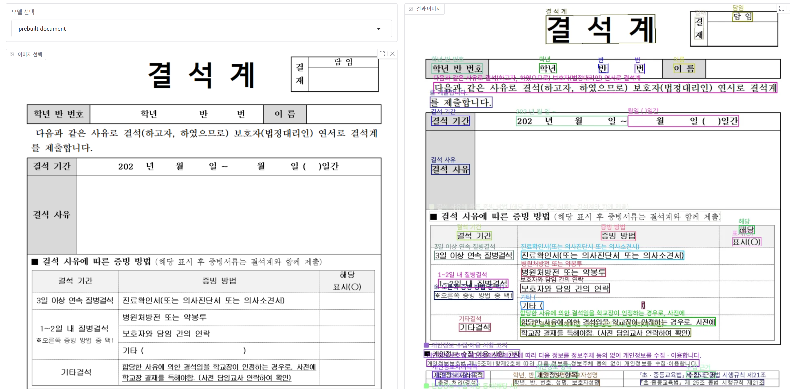

### 📂 GitHub에서 보기: [microsoft-ai-school/2025.06.26](https://github.com/J1STAR/microsoft-ai-school/tree/main/2025.06.26)

# 📅 2025년 6월 26일: Azure AI 서비스를 활용한 문서 분석 및 자연어 처리 애플리케이션 개발

## 📝 학습 목표

이번 학습에서는 전날 구축한 Azure Document Intelligence 서비스를 기반으로 사용자 친화적인 웹 인터페이스를 구축하고, Azure AI 언어 서비스를 활용하여 텍스트 데이터에서 중요한 정보를 추출하는 방법을 학습합니다. 이를 통해 이미지 속 텍스트를 분석하고 시각화하는 OCR 애플리케이션을 완성하고, 자연어 처리(NLP) 기술의 실제적인 활용 사례를 경험합니다.

- **Gradio를 활용한 웹 UI 구축**: Python으로 빠르고 쉽게 머신러닝 모델의 웹 UI를 만드는 방법을 익힙니다.
- **OCR 결과 시각화**: Document Intelligence가 분석한 결과를 원본 이미지 위에 바운딩 박스와 텍스트로 시각화하여 사용자 경험을 향상시킵니다.
- **Azure AI 언어 서비스 활용**: 개인 식별 정보(PII) 탐지, 명명된 개체 인식(NER), 그리고 **보건 의료용 텍스트 분석**과 같은 고급 자연어 처리 기능을 API를 통해 사용하는 방법을 학습합니다.
- **프로젝트 통합**: 여러 Azure AI 서비스를 조합하여 하나의 완성된 애플리케이션을 개발하는 과정을 이해합니다.

---

## 🖼️ 프로젝트 개요

이날의 프로젝트는 두 가지 주요 기능으로 구성됩니다.

1.  **문서 분석기 (Document Analyzer)**: 사용자가 이미지를 업로드하면 Azure Document Intelligence를 통해 OCR을 수행하고, 추출된 텍스트와 그 위치를 원본 이미지에 그려서 보여주는 Gradio 기반 웹 애플리케이션입니다.
2.  **언어 분석기 (Language Analyzer)**: 주어진 텍스트에서 개인정보(PII), 주요 개체(NER), 그리고 **의료 정보(Text Analytics for Health)**를 식별하는 Azure AI 언어 서비스의 API를 테스트합니다.

이 두 기능을 통해 이미지와 텍스트 데이터를 종합적으로 분석하고 처리하는 능력을 기릅니다.

---

## 📁 파일 구성 및 설명

| 파일명 | 설명 |
| :--- | :--- |
| `main.py` | Gradio를 사용하여 Document Intelligence OCR 결과를 시각화하는 웹 애플리케이션의 메인 코드입니다. |
| `language.http` | Azure AI 언어 서비스의 PII 탐지, NER, **보건 의료용 텍스트 분석** API를 테스트하기 위한 HTTP 요청 파일입니다. (VS Code REST Client 확장 프로그램 사용) |
| `app_screenshot.png` | `main.py` 실행 시 나타나는 웹 애플리케이션의 최종 결과 화면 스크린샷입니다. |
| `README.md` | 본 학습 내용에 대한 정리 문서입니다. |

---

## 🚀 주요 코드 및 실행 결과

### 1. Gradio를 이용한 문서 분석 애플리케이션 (`main.py`)

`main.py`는 `2025.06.25` 폴더의 `document_intelligence.py` 모듈을 재사용하여 기능을 확장합니다. 사용자가 이미지를 업로드하고 분석 모델(`prebuilt-document` 또는 `prebuilt-read`)을 선택하면, 서버에서 Document Intelligence API를 호출하고 분석 결과를 받아옵니다.

핵심 로직은 분석 결과를 `Pillow` 라이브러리를 사용해 원본 이미지 위에 다각형(polygon)과 텍스트로 그려주는 `draw_result_image` 함수에 있습니다.

```python
# main.py

def draw_result_image(image_path: str, result: dict) -> Image.Image:
    """Draw polygons on the image based on the analysis result.

    Args:
        image_path (str): The path to the image file.
        result (dict): The analysis result from the document intelligence service.

    Returns:
        Image.Image: The image with polygons drawn on it.
    """
    image = Image.open(image_path)
    # ... (폰트 설정) ...

    draw = ImageDraw.Draw(image)
    if result.get("analyzeResult"):
        for page in result["analyzeResult"]["pages"]:
            for line in page["lines"]:
                # 각 텍스트 라인마다 랜덤 색상으로 바운딩 박스 그리기
                color = (
                    random.randint(0, 255),
                    random.randint(0, 255),
                    random.randint(0, 255),
                )
                draw.polygon(line["polygon"], outline=color, width=2)

                # 인식된 텍스트 내용 표시
                text_x = line["polygon"][0]
                text_y = line["polygon"][1]

                draw.text(
                    (text_x, text_y - 20),
                    line["content"],
                    fill=color,
                    font=font,
                )

    return image
```

#### ✨ 실행 결과

`main.py`를 실행하고 웹 브라우저에서 이미지를 업로드하면 아래와 같이 분석된 결과를 시각적으로 확인할 수 있습니다.



### 2. Azure AI 언어 서비스를 이용한 텍스트 분석 (`language.http`)

`language.http` 파일은 Azure AI 언어 서비스의 강력한 자연어 처리 기능을 직접 테스트해볼 수 있는 예제입니다. 이 파일은 `REST Client` 확장 프로그램을 통해 실행되며, 긴 텍스트에서 자동으로 개인정보나 특정 개체를 찾아내는 API를 호출합니다.

-   **PII (개인 식별 정보) 탐지**: 이름, 주소, 전화번호, 이메일 등 개인정보를 식별합니다.
-   **NER (명명된 개체 인식)**: 사람, 장소, 기관, 날짜 등 정해진 카테고리의 개체를 인식합니다.
-   **⚕️ 보건 의료용 텍스트 분석 (Text Analytics for Health)**: 진단명, 증상, 약물, 신체 부위 등 의료 분야에 특화된 정보를 추출합니다. 이 API는 비동기적으로 작동하여, 분석 작업을 요청한 후 별도의 요청으로 결과를 가져옵니다.

```http
# language.http

### 보건 의료용 텍스트 분석 작업 요청 (POST)
POST {{$dotenv AZURE_LANGUAGE_ENDPOINT_URL}}/language/analyze-text/jobs?api-version=2024-11-15-preview
Content-Type: application/json
Ocp-Apim-Subscription-Key: {{$dotenv AZURE_LANGUAGE_API_KEY}}

{
    "analysisInput": {
        "documents": [
            {
                "text": "... 최근에 저는 건강 검진을 받았고, 그 결과 고혈압 진단을 받았습니다. ... 주치의의 이름은 박지훈이며, 그의 병원은 서울 강서구에 위치한 강서메디컬입니다. ...",
                "language": "en",
                "id": "1"
            }
        ]
    },
    "tasks":[{"taskId": "analyze 1","kind": "Healthcare","parameters": {"fhirVersion": "4.0.1"}}]
}

### 분석 결과 조회 (GET)
GET {{$dotenv AZURE_LANGUAGE_ENDPOINT_URL}}/language/analyze-text/jobs/{JOB_ID}?api-version=2024-11-15-preview
Content-Type: application/json
Ocp-Apim-Subscription-Key: {{$dotenv AZURE_LANGUAGE_API_KEY}}
```

이 요청은 텍스트 내의 의료 관련 정보를 FHIR(Fast Healthcare Interoperability Resources) 표준 형식에 맞춰 구조화된 데이터로 추출하여 반환합니다.

---

## 💡 학습 정리

이번 세션을 통해 Azure의 강력한 AI 서비스 두 가지(Document Intelligence, AI Language)를 연동하여 실제적인 문제를 해결하는 방법을 배웠습니다. 특히, **보건 의료**와 같이 특정 도메인에 특화된 AI 모델을 API로 쉽게 활용할 수 있다는 점을 확인했습니다. 단순히 API를 호출하는 것을 넘어, Gradio를 통해 시각적인 결과물을 만들어내는 과정은 AI 서비스를 어떻게 최종 사용자에게 효과적으로 전달할 수 있는지에 대한 중요한 경험이 되었습니다. 이로써 OCR 기술과 일반 및 도메인 특화 NLP 기술을 결합한 통합적인 AI 솔루션 개발의 기초를 다졌습니다.

---

## 👨‍💻 About Me

**HanByeol Jang (장한별)**

<a href="mailto:j.1star.0726@gmail.com"></a>
<a href="https://github.com/J1STAR"></a>
<a href="https://www.linkedin.com/in/hanbyeol-jang-44174a199/"></a>