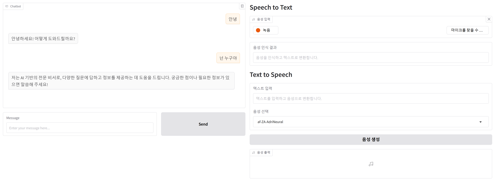

### [microsoft-ai-school/2025.06.30](https://github.com/J1STAR/microsoft-ai-school/tree/main/2025.06.30)

# 📅 2025년 6월 30일: Gradio와 Azure OpenAI를 활용한 다중 모드 AI 챗봇 개발

## 📝 학습 목표

이번 학습에서는 이전 세션에서 배운 Azure의 음성 서비스(STT/TTS)와 채팅 모델을 통합하여, 음성으로 대화할 수 있는 다중 모드(Multi-modal) AI 챗봇 애플리케이션을 개발합니다. 사용자의 음성 입력을 텍스트로 변환하고, 챗봇의 텍스트 응답을 다시 음성으로 출력하는 완전한 음성 기반 상호작용을 구현합니다.

- **Gradio UI 통합**: Gradio 프레임워크를 사용하여 챗봇, 음성-텍스트 변환(STT), 텍스트-음성 합성(TTS) 기능을 하나의 웹 인터페이스에 통합하는 방법을 학습합니다.
- **모듈화 및 코드 재사용**: 이전에 개발한 `speech` 및 `openai_service` 모듈을 `sys.path` 수정을 통해 임포트하여 재사용함으로써, 효율적인 프로젝트 구성 방법을 익힙니다.
- **음성 기반 챗봇 흐름 제어**: 사용자의 음성 입력을 챗봇의 입력으로 전달하고, 챗봇의 응답을 TTS를 통해 음성으로 자동 재생하는 데이터 흐름을 구현합니다.
- **Azure OpenAI 서비스 연동**: Azure OpenAI의 채팅 모델을 백엔드로 사용하여 자연스러운 대화를 생성하고, 이를 음성 서비스와 연계하여 사용자 경험을 향상시킵니다.

---

## 🖼️ 프로젝트 개요

이날의 프로젝트는 사용자와 음성으로 대화할 수 있는 통합 AI 어시스턴트 애플리케이션입니다. Gradio를 사용하여 구축된 웹 UI는 세 가지 핵심 기능을 제공합니다.

1.  **AI 챗봇**: Azure OpenAI의 강력한 언어 모델을 기반으로 사용자와 텍스트 기반 대화를 나눕니다.
2.  **음성-텍스트 변환 (Speech to Text)**: 마이크로폰 입력을 받아 실시간으로 텍스트로 변환합니다. 변환된 텍스트는 챗봇에 입력하거나 다른 용도로 활용할 수 있습니다.
3.  **텍스트-음성 합성 (Text to Speech)**: 챗봇의 응답이나 사용자가 입력한 텍스트를 자연스러운 음성으로 변환하여 들려줍니다.

이 기능들을 결합하여, 사용자가 마이크에 대고 질문하면 AI가 음성으로 대답하는 매끄러운 사용자 경험을 제공합니다.

---

## 📁 파일 구성 및 설명

| 파일명 | 설명 |
| :--- | :--- |
| `main.py` | Gradio를 사용하여 **챗봇**, **STT**, **TTS** 기능을 통합한 메인 애플리케이션입니다. 전체 UI 레이아웃과 이벤트 처리를 담당합니다. |
| `services/openai_service.py` | Azure OpenAI의 채팅 모델 API와 연동하는 서비스 클래스입니다. 챗봇의 응답을 생성하고, 응답 텍스트를 `speech` 모듈에 전달하여 음성으로 변환합니다. |
| `data/audio/test.wav` | STT 기능 테스트에 사용될 수 있는 샘플 오디오 파일입니다. |
| `spx` | (내용 미확인) Azure Speech CLI 관련 구성 또는 스크립트로 추정됩니다. |
| `README.md` | 본 학습 내용에 대한 정리 문서입니다. |

*참고: `main.py`와 `openai_service.py`는 `2025.06.27` 폴더에 있는 `speech.py` 모듈을 동적으로 로드하여 사용합니다.*

---

## 🚀 주요 코드 및 실행 결과

### 다중 모드 상호작용 구현 (`main.py` & `openai_service.py`)

`main.py`는 Gradio를 사용하여 전체 UI를 구성합니다. 챗봇의 `send_button` 클릭 이벤트는 `openai_service.chat` 함수를 호출합니다. 이 함수는 OpenAI로부터 받은 텍스트 응답을 반환할 뿐만 아니라, 이 텍스트를 즉시 음성으로 변환하여 오디오 출력을 생성합니다.

```python
# services/openai_service.py

class OpenAIService:
    # ... (초기화 및 요청 로직) ...

    def chat(
        self,
        prompt: str,
        history: List[List[str]],
        args: Optional[Dict[str, Any]] = None,
    ) -> tuple[str, list[list[str]], str]: # 반환 값에 음성 파일 경로(str) 추가
        # ... (메시지 구성) ...
        
        # Azure OpenAI에 채팅 요청
        response_message = self._request_to_openai(messages, args)
        
        # 대화 기록 업데이트
        messages.append({"role": "assistant", "content": response_message.content})

        # 응답 텍스트를 음성으로 변환하여 파일 경로 반환
        audio_filepath = synthesize_speech(response_message.content, "ko-KR-YuJinNeural")
        
        return "", messages, audio_filepath
```

`main.py`에서는 `openai_service.chat`이 반환한 `audio_filepath`를 `output_audio` 컴포넌트에 연결하여 자동으로 재생합니다.

```python
# main.py

# ... (Gradio UI 구성) ...

# Chatbot 이벤트 핸들러
send_button.click(
    fn=openai_service.chat,
    inputs=[user_input, chatbot],
    # 세 번째 출력으로 output_audio를 지정하여 음성 자동 재생
    outputs=[user_input, chatbot, output_audio],
)

# ... (STT 및 TTS 독립 기능 구성) ...
```

#### ✨ 실행 결과

`main.py`를 실행하면 세 부분으로 구성된 웹 페이지가 나타납니다.
- **챗봇 창**: 사용자가 메시지를 입력하면 AI의 텍스트 응답이 표시되고, 동시에 음성 응답이 자동으로 재생됩니다.
- **Speech to Text**: 마이크 버튼을 눌러 음성을 녹음하면 텍스트로 변환된 결과가 나타납니다.
- **Text to Speech**: 텍스트를 입력하고 원하는 목소리를 선택하면 음성을 생성하여 들을 수 있습니다.



---

## 💡 학습 정리

이번 세션에서는 여러 AI 서비스를 조합하여 시너지를 내는 방법을 실습했습니다. 개별적으로 작동하던 **채팅, STT, TTS 기능을 하나의 애플리케이션으로 통합**함으로써, 사용자에게 훨씬 더 직관적이고 편리한 '대화형 AI' 경험을 제공할 수 있음을 확인했습니다.

또한, 기존에 작성했던 코드를 모듈로 만들어 재사용하는 방식을 통해, 복잡한 애플리케이션을 효율적으로 개발하고 유지보수하는 능력을 길렀습니다. 이는 실제 소프트웨어 개발 현장에서 매우 중요한 역량입니다. 이번 프로젝트를 통해 AI 기술을 실제 사용 사례에 적용하는 통합적인 시각을 갖게 되었습니다. 

---

## 👨‍💻 About Me

**HanByeol Jang (장한별)**

<a href="mailto:j.1star.0726@gmail.com"></a>
<a href="https://github.com/J1STAR"></a>
<a href="https://www.linkedin.com/in/hanbyeol-jang-44174a199/"></a> 