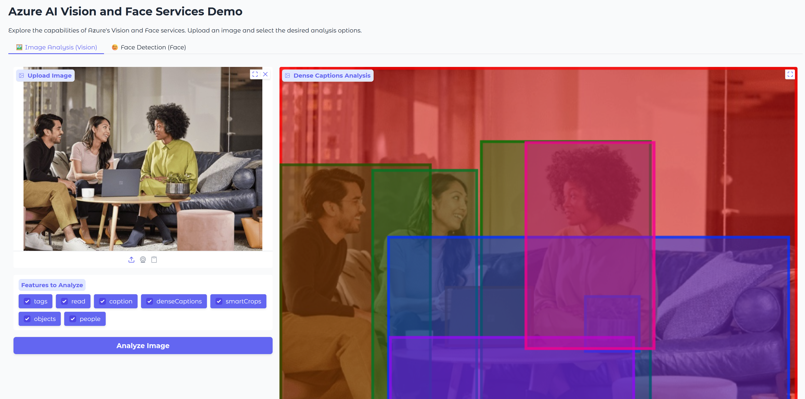
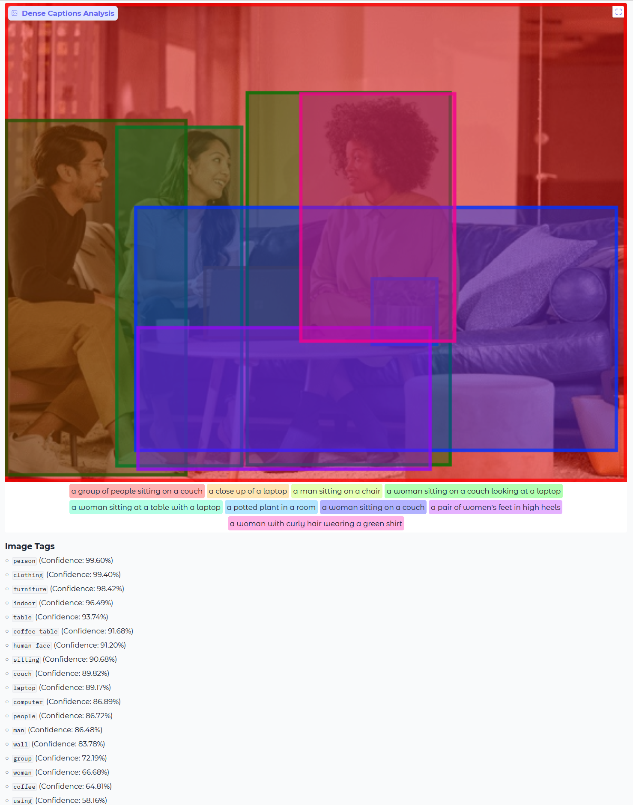
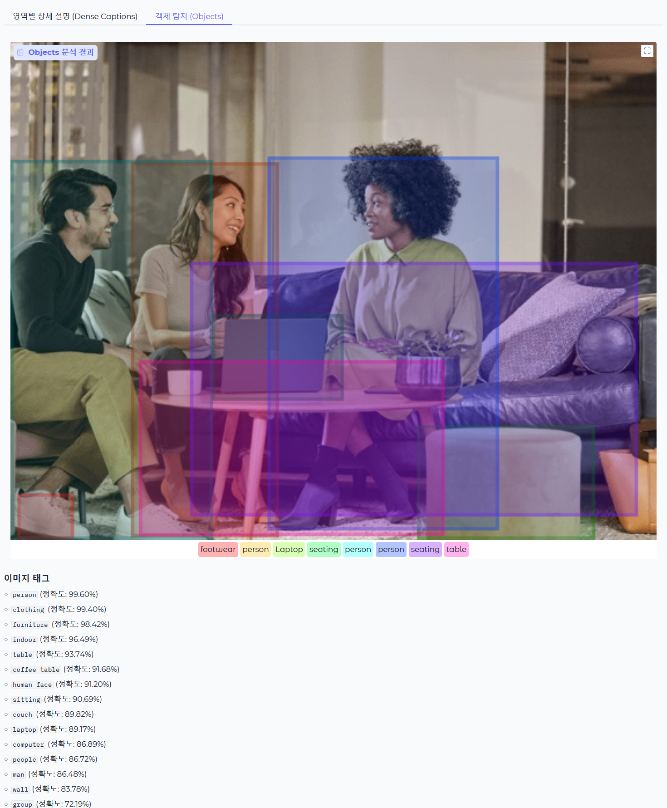
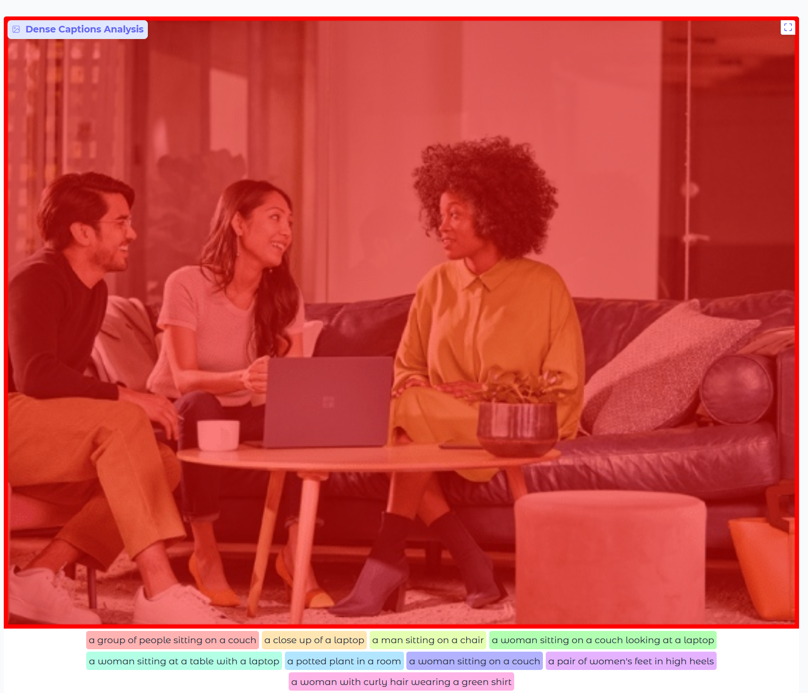
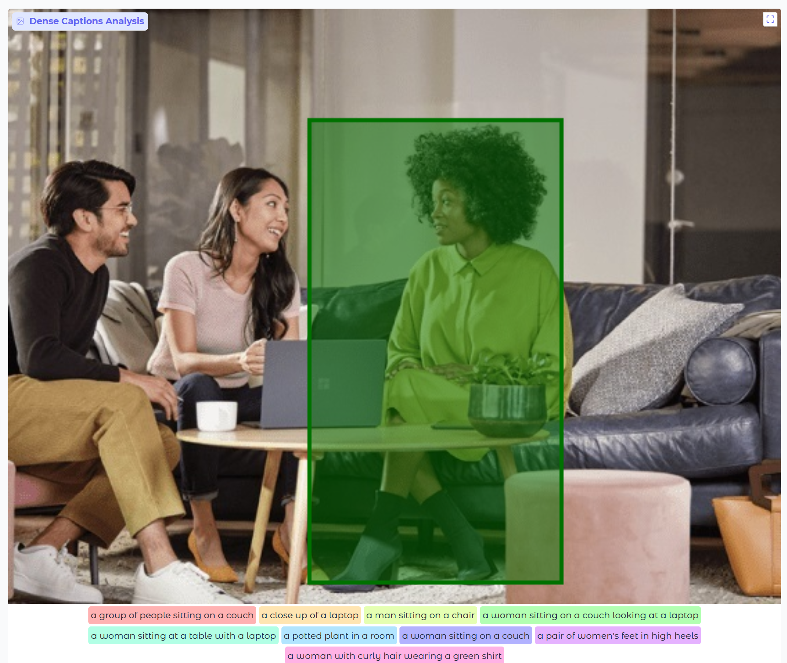
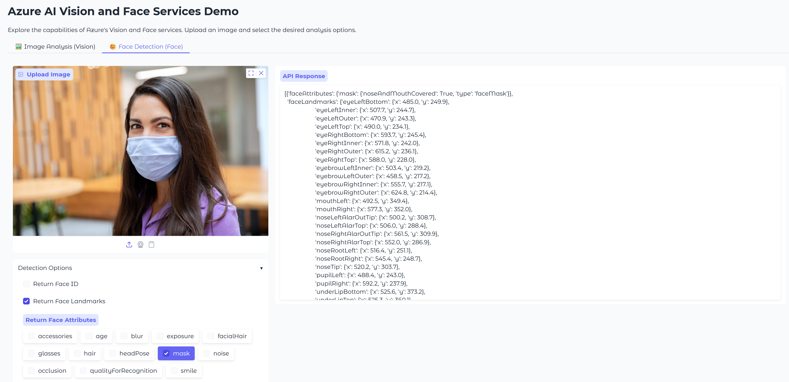
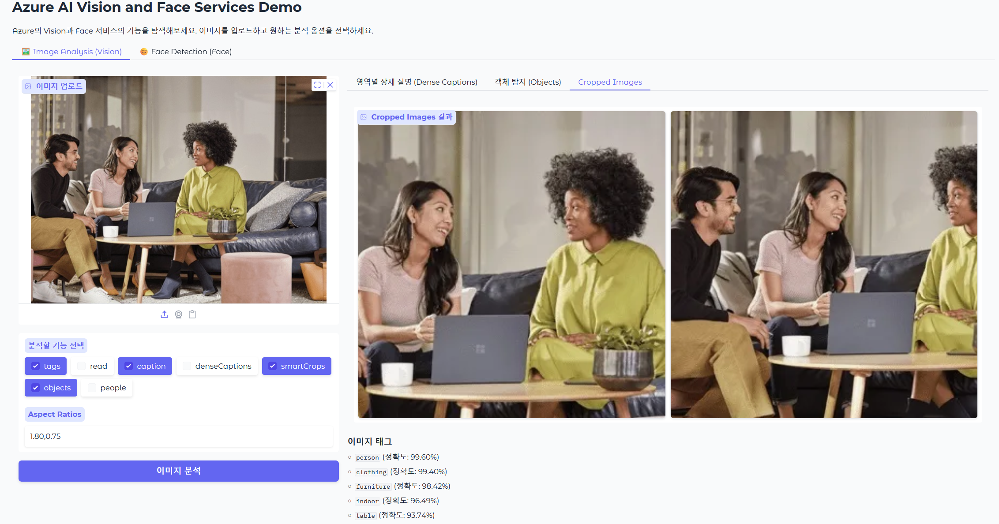

### [microsoft-ai-school/2025.07.02 ~ 2025.07.03](https://github.com/J1STAR/microsoft-ai-school/tree/main/2025.07.02)

# 📅 2025년 7월 2일: Azure Vision & Face 서비스를 활용한 이미지 분석 웹 앱 개발

## 📝 학습 목표

이번 학습에서는 Azure의 강력한 인공지능 서비스인 **Vision Service**와 **Face Service**를 활용하여, 이미지 속 정보를 다각도로 분석하는 웹 애플리케이션을 개발합니다. Gradio 프레임워크를 사용하여 사용자가 직관적으로 이미지를 업로드하고 분석 결과를 시각적으로 확인할 수 있는 UI를 구축하는 데 중점을 둡니다.

- **Azure AI 서비스 연동**: Python 환경에서 `requests` 라이브러리를 사용하여 Azure의 REST API(Vision, Face)와 통신하는 방법을 학습합니다.
- **서비스 클래스 모듈화**: API 호출 로직을 `VisionService`와 `FaceService`라는 별도의 클래스로 캡슐화하여, 코드의 재사용성과 유지보수성을 높이는 방법을 익힙니다.
- **대화형 웹 UI 구축**: Gradio를 사용하여 이미지 업로드, 기능 선택(체크박스), 결과 출력(주석 이미지, 텍스트, 마크다운) 등 다양한 컴포넌트를 조합하여 사용자 친화적인 인터페이스를 설계합니다.
- **API 결과 시각화**: API로부터 받은 복잡한 JSON 형식의 데이터를 사용자가 쉽게 이해할 수 있도록, 이미지 위에 바운딩 박스를 그리거나(AnnotatedImage), 주요 정보를 목록(Markdown)으로 요약하는 등 시각적으로 가공하는 방법을 실습합니다.

---

## 🖼️ 프로젝트 개요

이날의 프로젝트는 사용자가 업로드한 이미지 한 장에서 풍부한 정보를 추출하고 시각화해주는 **지능형 이미지 분석 도구**입니다. 애플리케이션은 두 가지 핵심 기능을 탭으로 구분하여 제공합니다.

1.  **이미지 분석 (Vision Service)**: 이미지의 전체적인 맥락을 이해하는 기능입니다.
    -   **Tags**: 이미지와 관련된 핵심 키워드들을 신뢰도 점수와 함께 추출합니다. (`#사람`, `#의류`)
    -   **Caption**: 이미지를 한 문장으로 요약합니다. (`테이블 위의 무언가를 보고 있는 여성들`)
    -   **Dense Captions**: 이미지의 특정 영역별로 상세한 설명을 바운딩 박스와 함께 제공합니다.
    -   **Smart Crops (기능 개선)**: 사용자가 원하는 비율로 잘라낸 이미지들을 **갤러리 형태**로 직접 보여줍니다. 사용자가 'smartCrops' 기능을 선택할 때만 관련 옵션(종횡비) 입력창이 동적으로 노출되어 제공합니다.
    -   이 외에도 `Objects`, `People`, `Read`(OCR) 등 다양한 분석이 가능합니다.

2.  **얼굴 감지 (Face Service)**: 이미지 속 인물의 얼굴에 집중하여 상세 정보를 분석합니다.
    -   얼굴의 위치를 정확히 찾아내고, `age`(나이), `smile`(미소 여부), `glasses`(안경 착용), `mask`(마스크 착용) 등 다양한 속성을 분석하여 반환합니다.

사용자는 이 도구를 통해 단순한 이미지를 넘어, 그 안에 담긴 이야기와 데이터를 발견하는 경험을 할 수 있습니다.



---

## 📁 파일 구성 및 설명

| 파일명 | 설명 |
| :--- | :--- |
| `main.py` | Gradio를 사용하여 **이미지 분석**과 **얼굴 감지** 탭을 가진 메인 애플리케이션 UI를 구성하고, 각 서비스 함수와 연결하는 역할을 합니다. |
| `services/vision_service.py` | Azure AI Vision 서비스 API와 통신하는 `VisionService` 클래스입니다. 이미지 URL 또는 로컬 파일을 받아 분석을 요청하고 결과를 반환합니다. |
| `services/face_service.py` | Azure AI Face 서비스 API와 통신하는 `FaceService` 클래스입니다. 얼굴 감지 및 속성 분석을 요청하고 결과를 반환합니다. |
| `vision.http` | Visual Studio Code의 REST Client 확장 프로그램을 사용하여 각 API를 직접 테스트해 볼 수 있는 HTTP 요청 파일입니다. |
| `data/` | 분석 테스트에 사용할 샘플 이미지들이 저장된 디렉터리입니다. |
| `results/` | 실습 과정에서 생성된 주요 실행 결과 스크린샷이 저장된 디렉터리입니다. |
| `README.md` | 본 학습 내용에 대한 정리 문서입니다. |

---

## 🚀 주요 코드 및 실행 결과 (7월 2일)

### 이미지 분석 결과 시각화 (`main.py`)

`vision_api_call` 함수는 단순히 API 응답을 텍스트로 출력하는 것을 넘어, 사용자가 결과를 쉽게 이해하도록 시각적으로 가공하는 중요한 역할을 합니다. 특히 여러 분석 결과가 하나의 이미지 위에 겹쳐 어지럽게 보일 수 있는 문제를 해결하기 위해, **각 분석 결과를 별도의 탭으로 분리하여** 명확하게 보여주는 구조를 채택했습니다.

-   **데이터 가공**: API에서 받은 JSON 데이터에서 `denseCaptionsResult`, `objectsResult`, `tagsResult` 등의 값을 추출합니다.
-   **시각화 데이터 생성**: `AnnotatedImage` 컴포넌트에 맞게 (원본 이미지, [바운딩 박스, 라벨] 리스트) 형식의 튜플을 생성하고, `Markdown` 컴포넌트를 위해 태그 목록을 문자열로 만듭니다.
-   **결과 반환**: 가공된 데이터들을 각 UI 컴포넌트에 맞는 출력 순서에 따라 튜플로 묶어 반환합니다.

```python
# main.py

def vision_api_call(
    image_path: str, features: list[str], smart_crops_aspect_ratios: str
) -> tuple[
    str | tuple[str, list] | None,
    str | tuple[str, list] | None,
    list[Image.Image] | None,
    str,
    str,
]:
    # --- 1. 입력 유효성 검사 ---
    if not image_path:
        return None, None, None, "### 이미지 태그\n", "이미지를 먼저 업로드해주세요."

    if not features:
        return (
            image_path,
            image_path,
            [],
            "### 이미지 태그\n",
            "하나 이상의 분석 기능을 선택해주세요.",
        )

    # --- 2. Vision 서비스 호출 및 예외 처리 ---
    vision_service = VisionService()
    try:
        result = vision_service.analyze_image(image_path, features, smart_crops_aspect_ratios=smart_crops_aspect_ratios)
    except Exception as e:
        return None, None, None, "### 오류 발생", f"서비스 호출 중 오류가 발생했습니다: {e}"

    # --- 3. API 응답 결과 가공 ---
    # 'denseCaptions' 결과 처리
    dense_captions_annotations = []
    if "denseCaptions" in features and result.get("denseCaptionsResult"):
        for caption in result["denseCaptionsResult"]["values"]:
            box = caption["boundingBox"]
            x, y, w, h = box["x"], box["y"], box["w"], box["h"]
            annotation_box = (x, y, x + w, y + h)
            dense_captions_annotations.append((annotation_box, caption["text"]))
    dense_captions_output = (image_path, dense_captions_annotations)

    # 'objects' 결과 처리
    objects_annotations = []
    if "objects" in features and result.get("objectsResult"):
        for obj in result["objectsResult"]["values"]:
            if obj.get("tags"):
                box = obj["boundingBox"]
                label = obj["tags"][0]["name"]
                x, y, w, h = box["x"], box["y"], box["w"], box["h"]
                annotation_box = (x, y, x + w, y + h)
                objects_annotations.append((annotation_box, label))
    objects_output = (image_path, objects_annotations)

    # 'smartCrops' 결과 처리
    cropped_images_output = []
    if "smartCrops" in features and result.get("smartCropsResult"):
        source_image = Image.open(image_path)
        for crop in result["smartCropsResult"]["values"]:
            box = crop["boundingBox"]
            x, y, w, h = box["x"], box["y"], box["w"], box["h"]
            cropped_img = source_image.crop((x, y, x + w, y + h))
            cropped_images_output.append(cropped_img)

    # 'tags' 결과 처리
    tags_markdown = "### 이미지 태그\n"
    if "tags" in features and result.get("tagsResult"):
        tags_list = [
            f"- `{tag['name']}` (정확도: {tag['confidence']:.2%})"
            for tag in result["tagsResult"]["values"]
        ]
        tags_markdown += "\n".join(tags_list)
    else:
        tags_markdown += "_태그를 찾을 수 없거나 'tags' 기능이 선택되지 않았습니다._"

    raw_json_output = pformat(result)

    return dense_captions_output, objects_output, cropped_images_output, tags_markdown, raw_json_output

#### ✨ 실행 결과 1: 이미지 태그 분석

'tags' 기능을 선택하고 이미지를 분석하면, `tagsResult`의 내용이 우측의 '이미지 태그' 영역에 마크다운 목록으로 깔끔하게 표시됩니다.



#### ✨ 실행 결과 2: 객체 탐지 분석

'objects' 기능을 선택하면, '객체 탐지' 탭에 이미지 속에서 인식된 각 사물(person, seating 등)의 위치가 바운딩 박스와 라벨로 명확하게 표시됩니다.



#### ✨ 실행 결과 3: 영역별 상세 설명 분석

'denseCaptions' 기능을 선택하면, '영역별 상세 설명' 탭에서 이미지의 각 주요 영역에 대한 설명이 바운딩 박스와 함께 시각화됩니다.




#### ✨ 실행 결과 4: 얼굴 속성 분석

'Face Detection' 탭에서 이미지를 분석하면, API가 반환하는 얼굴의 위치, 나이, 마스크 착용 여부 등의 상세 정보가 우측 'API 응답' 영역에 JSON 형식으로 출력됩니다.



---

## 💡 학습 정리 (7월 2일)

이번 세션을 통해 Azure의 강력한 AI 서비스를 Python 코드 몇 줄만으로 활용하고, 이를 Gradio라는 도구를 통해 누구나 쉽게 사용할 수 있는 웹 애플리케이션으로 만드는 과정을 경험했습니다.

특히 API가 반환하는 정형 데이터(JSON)를 그대로 보여주는 것에서 한 걸음 더 나아가, **사용자의 관점에서 정보를 재가공하고 시각화하는 것**이 얼마나 사용자 경험을 향상시키는지 체감할 수 있었습니다. 처음에는 모든 시각화 결과를 한 곳에 표시했지만, 정보가 너무 많아 오히려 이해하기 어렵다는 피드백을 통해 **각 분석 결과를 별도의 탭으로 분리하는 개선**을 진행했습니다. 이 과정을 통해 좋은 UI/UX는 단순히 기능을 제공하는 것을 넘어, 사용자가 정보를 명확하고 쾌적하게 소비할 수 있도록 설계해야 함을 깨달았습니다.

---

# 📅 2025년 7월 3일: 기능 개선 및 고도화

기존에 구축한 이미지 분석 앱의 사용자 경험(UX)을 향상시키기 위해 다음과 같은 기능 개선을 진행했습니다.

### ✨ 기능 개선 1: 사용자 선택에 따른 동적 UI 구현 (`main.py`)

사용자가 'smartCrops' 기능을 체크할 때만 종횡비(Aspect Ratios)를 입력하는 텍스트 박스가 나타나도록 하여 UI를 더욱 깔끔하고 직관적으로 개선했습니다. Gradio의 `change` 이벤트 핸들러를 사용하여 이 동적 기능을 구현합니다.

```python
# main.py

def update_smart_crops_visibility(features: list[str]) -> dict:
    """'smartCrops' 선택 여부에 따라 Aspect Ratios 입력 필드의 가시성을 조절합니다."""
    return gr.update(visible="smartCrops" in features)

# --- Gradio UI 구성 ---
with gr.Blocks(...) as demo:
    # ...
    vision_features = gr.CheckboxGroup(...)
    vision_smart_crops_aspect_ratios = gr.Textbox(visible=False, ...) # 기본적으로 숨김
    # ...

    # --- 이벤트 핸들러 연결 ---
    vision_features.change(
        fn=update_smart_crops_visibility,
        inputs=[vision_features],
        outputs=[vision_smart_crops_aspect_ratios],
    )
```

### ✨ 기능 개선 2: 'Smart Crops' 결과 시각화 개선 (`main.py`)

API가 반환한 `smartCropsResult`의 바운딩 박스 좌표를 이용해, `Pillow` 라이브러리로 원본 이미지를 직접 잘라냅니다. 이렇게 생성된 여러 이미지 조각들을 Gradio의 `Gallery` 컴포넌트를 통해 한 번에 사용자에게 보여줍니다. 이는 경계 상자만 표시하는 것보다 훨씬 직관적인 결과물을 제공합니다.

```python
# main.py

def vision_api_call(...):
    # ... (서비스 호출) ...

    # 'smartCrops' 결과 처리
    cropped_images_output = []
    if "smartCrops" in features and result.get("smartCropsResult"):
        source_image = Image.open(image_path)
        for crop in result["smartCropsResult"]["values"]:
            box = crop["boundingBox"]
            x, y, w, h = box["x"], box["y"], box["w"], box["h"]
            cropped_img = source_image.crop((x, y, x + w, y + h))
            cropped_images_output.append(cropped_img)
    
    # ...
    return ..., cropped_images_output, ...

# --- Gradio UI 구성 ---
with gr.Blocks(...) as demo:
    # ...
    with gr.TabItem("Cropped Images(Smart Crops)"):
        vision_cropped_images_output = gr.Gallery(label="Cropped Images 결과")
    # ...
```

#### ✨ 실행 결과: 스마트 크롭(Smart Crops) 분석

'smartCrops' 기능을 선택하면 AI가 추천하는 다양한 구도로 잘린 이미지들이 'Cropped Images' 탭에 갤러리 형태로 표시되어, 사용자가 최적의 결과물을 한눈에 보고 선택할 수 있습니다.



### 💡 학습 정리 (7월 3일)

이번 기능 개선을 통해 **사용자 경험(UX) 중심의 개발**이 왜 중요한지를 실감했습니다. 단순히 기능을 추가하는 것을 넘어, 사용자의 작업 흐름을 고려하여 UI를 동적으로 만들고(`update_smart_crops_visibility`), 분석 결과를 보다 직관적인 형태(`Gallery`)로 제공함으로써 애플리케이션의 가치를 크게 향상시킬 수 있었습니다.

특히 API가 제공하는 데이터를 그대로 보여주는 것과, 그 데이터를 가공하여 사용자에게 '쓸모있는' 결과물로 만들어주는 것은 큰 차이가 있음을 깨달았습니다. 이러한 디테일한 개선 과정들이 모여 사용자가 만족하는 서비스를 만들게 된다는 점을 학습했습니다.

---

## 👨‍💻 About Me

|  |  |
| :--- | :--- |
| **Name** | HanByeol Jang (장한별) |
| **Email** | 📧 j.1star.0726@gmail.com |
| **GitHub** |  [J1STAR](https://github.com/J1STAR) |
| **LinkedIn** |  [HanByeol Jang](https://www.linkedin.com/in/hanbyeol-jang-44174a199/) |
