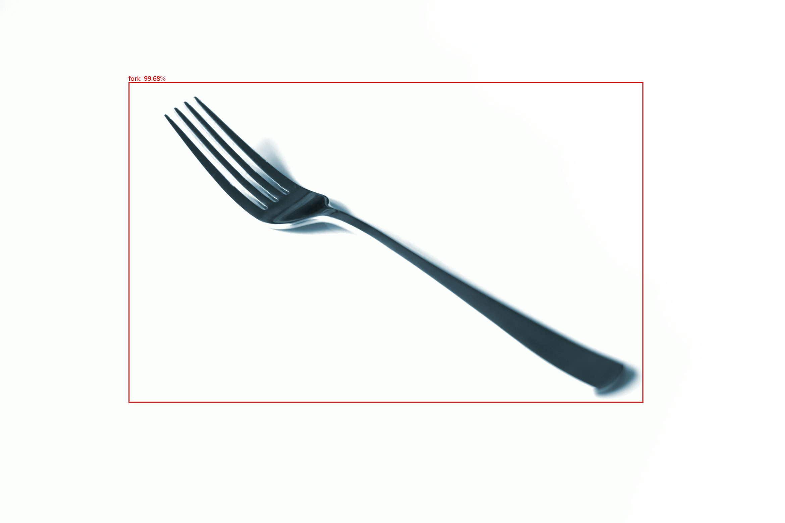
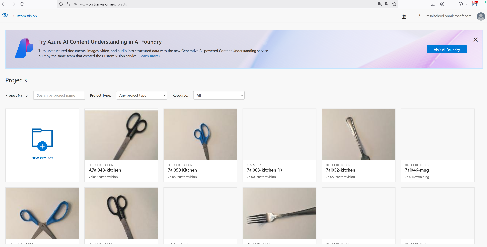
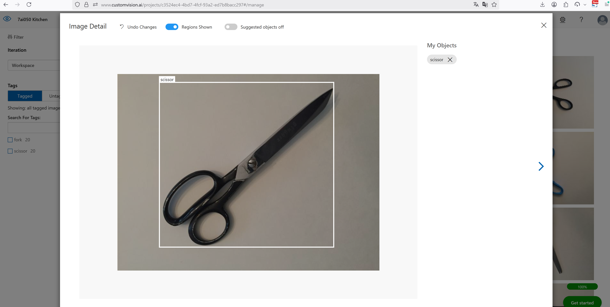
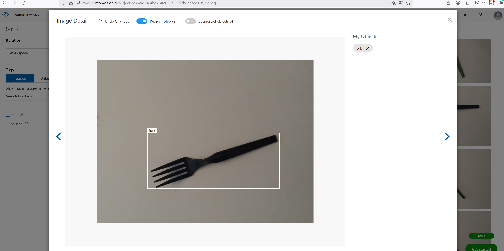
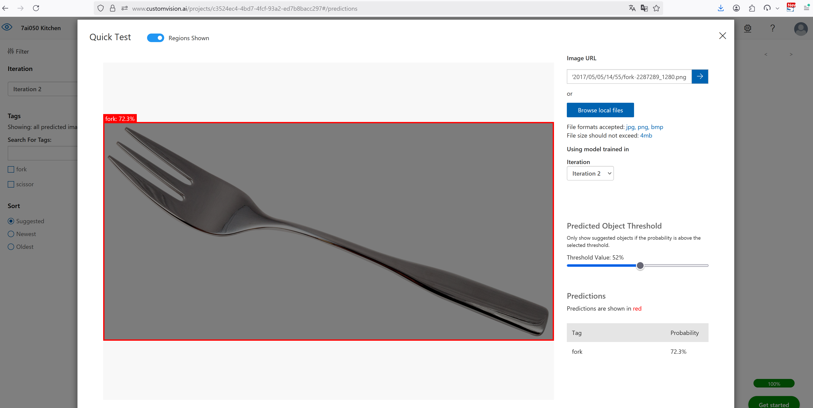
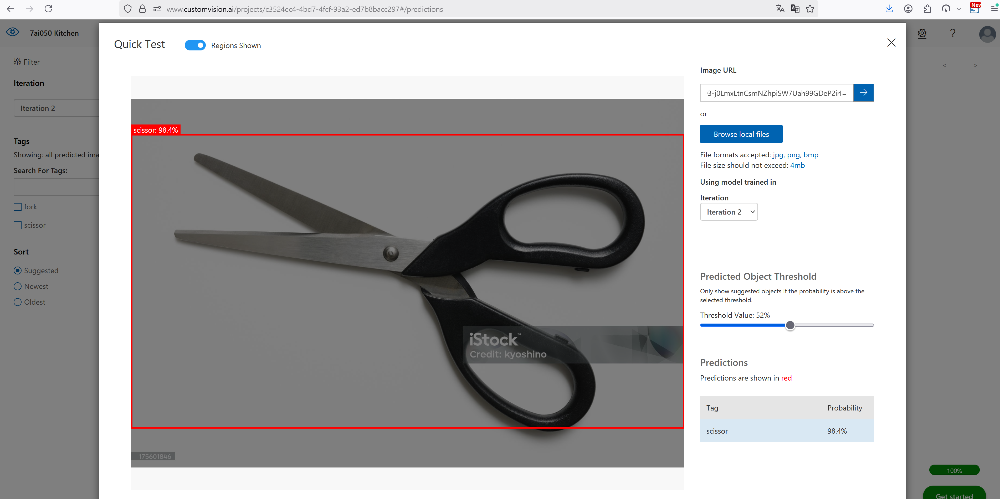

### 📂 GitHub에서 보기: [microsoft-ai-school/2025.07.04](https://github.com/J1STAR/microsoft-ai-school/tree/main/2025.07.04)

# 📅 2025년 7월 4일: Azure Custom Vision을 이용한 객체 탐지 모델 구축 자동화

## 📝 학습 목표

이번 학습에서는 Azure의 **Custom Vision 서비스**를 활용하여, 특정 객체(포크, 가위)를 탐지하는 AI 모델을 프로그래밍 방식으로 구축하고 배포하는 전체 파이프라인을 자동화하는 것을 목표로 합니다. 코드 작성을 통해 프로젝트 생성부터 데이터 업로드, 학습, 게시, 그리고 예측에 이르는 전 과정을 이해하고 실습합니다.

-   **Custom Vision SDK 활용**: Python용 Azure Custom Vision SDK(`azure-cognitiveservices-vision-customvision`)를 사용하여 서비스와 상호작용하는 방법을 학습합니다.
-   **모델 구축 파이프라인 이해**: AI 모델 개발의 전체 과정(데이터 준비 → 프로젝트 생성 → 태그 정의 → 이미지 및 레이블 업로드 → 학습 → 게시 → 예측)을 코드로 구현하며 이해합니다.
-   **서비스 클래스 모듈화**: Custom Vision의 '학습(Training)'과 '예측(Prediction)' API 관련 로직을 `CustomVisionService` 클래스로 캡슐화하여 코드의 구조와 재사용성을 높입니다.
-   **비동기 작업 처리**: 모델 학습과 같이 시간이 소요되는 비동기 작업을 '폴링(Polling)' 방식으로 대기하고 처리하는 방법을 익힙니다.
-   **결과 시각화**: 모델의 예측 결과를 `Pillow` 라이브러리를 사용해 원본 이미지 위에 바운딩 박스와 라벨로 시각화하여 저장합니다.

---

## 🖼️ 프로젝트 개요

이날의 프로젝트는 **"주방 용품(포크, 가위) 인식 모델"**을 코드로 직접 구축하는 과정을 자동화하는 스크립트입니다. `main.py` 파일을 실행하는 것만으로, Azure Custom Vision 서비스 내에서 다음과 같은 작업이 순차적으로 수행됩니다.

1.  **프로젝트 생성**: '7ai050 Kitchen'이라는 이름의 객체 탐지(Object Detection) 프로젝트를 생성합니다.
2.  **태그 정의**: `data/kitchen` 폴더 구조를 기반으로 'fork', 'scissor' 태그를 자동으로 생성합니다.
3.  **데이터 업로드**: 로컬에 저장된 이미지 파일과, 코드에 정의된 각 이미지의 객체 위치(Region) 데이터를 결합하여 서비스에 일괄 업로드합니다.
4.  **모델 학습**: 업로드된 데이터를 기반으로 모델 학습을 시작하고, 학습이 완료될 때까지 대기합니다.
5.  **모델 게시**: 학습이 완료된 모델을 예측에 사용할 수 있도록 특정 이름(`7ai050-kitchen-v1`)으로 게시합니다.
6.  **예측 및 시각화**: 웹에 있는 샘플 이미지를 사용하여 방금 게시한 모델로 예측을 수행하고, 탐지된 객체를 바운딩 박스로 표시하여 `output/predict_image.png` 파일로 저장합니다.

이 전체 과정을 통해 수동으로 웹사이트에서 수행하던 작업을 코드로 자동화함으로써, AI 모델 개발의 효율성과 재현성을 높일 수 있습니다.



---

## 📁 파일 구성 및 설명

| 파일명 | 설명 |
| :--- | :--- |
| `main.py` | 프로젝트 생성부터 예측까지 Custom Vision 모델 구축의 전체 파이프라인을 조율하는 메인 스크립트입니다. |
| `services/custom_vision_service.py` | Azure Custom Vision 서비스의 학습 및 예측 API와의 통신을 담당하는 `CustomVisionService` 클래스를 정의합니다. |
| `.env` | Azure 서비스의 엔드포인트 URL 및 API 키 등 민감한 정보를 저장하는 환경 변수 파일입니다. |
| `data/kitchen/` | 'fork', 'scissor' 하위 폴더에 학습용 이미지들이 저장된 디렉터리입니다. |
| `output/` | 최종 예측 결과 이미지가 저장되는 디렉터리입니다. |
| `results/` | 실습 과정의 각 단계별 주요 실행 결과 스크린샷이 저장된 디렉터리입니다. |
| `README.md` | 본 학습 내용에 대한 정리 문서입니다. |

---

### 🏛️ 서비스 클래스 설계 (`services/custom_vision_service.py`)

이 프로젝트의 핵심 설계 원칙 중 하나는 **관심사의 분리(Separation of Concerns)**입니다. `main.py`는 전체적인 작업 흐름(workflow)을 관리하는 데 집중하고, Azure 서비스와의 복잡한 통신 로직은 `CustomVisionService`라는 별도의 클래스에 모두 위임합니다.

이 서비스 클래스는 내부적으로 **학습(`_Trainer`)**과 **예측(`_Predictor`)**이라는 두 가지 주요 역할을 분리하여 관리합니다.

-   **`CustomVisionService`**: 메인 클래스로, API 인증 정보를 받아 학습 및 예측 클라이언트를 초기화합니다.
-   **`_Trainer`**: `create_project`, `upload_images`, `train`, `publish` 등 모델을 만들고 관리하는 모든 학습 관련 기능을 담당하는 내부 헬퍼 클래스입니다.
-   **`_Predictor`**: `predict_using_image_data` 등 학습된 모델을 사용하여 예측을 수행하는 기능을 담당하는 내부 헬퍼 클래스입니다.

이러한 구조 덕분에 `main.py`에서는 `custom_vision_service.trainer.create_project()`나 `custom_vision_service.predictor.predict_using_image_data()`처럼, 마치 잘 정리된 도구를 사용하듯 직관적으로 각 기능에 접근할 수 있습니다.

```python
# services/custom_vision_service.py

class CustomVisionService:
    """
    Azure Custom Vision Service와의 상호작용을 총괄하는 메인 서비스 클래스입니다.
    """

    def __init__(
        self,
        training_endpoint: str,
        prediction_endpoint: str,
        training_key: str,
        prediction_key: str,
    ):
        # --- 인증 및 클라이언트 초기화 ---
        self.__training_credentials = ApiKeyCredentials(...)
        self.__prediction_credentials = ApiKeyCredentials(...)
        self.__trainer_client = CustomVisionTrainingClient(...)
        self.__predictor_client = CustomVisionPredictionClient(...)

        # --- 역할에 따른 헬퍼 클래스 생성 ---
        self._trainer = _Trainer(self.__trainer_client)
        self._predictor = _Predictor(self.__predictor_client)

    @property
    def trainer(self) -> _Trainer:
        """학습 관련 기능(_Trainer)을 외부에 제공하는 속성(property)입니다."""
        return self._trainer

    @property
    def predictor(self) -> _Predictor:
        """예측 관련 기능(_Predictor)을 외부에 제공하는 속성(property)입니다."""
        return self._predictor

class _Trainer:
    """학습(Training) API와 관련된 기능들을 캡슐화한 헬퍼 클래스입니다."""
    def __init__(self, trainer_client: CustomVisionTrainingClient):
        self._trainer_client = trainer_client
    
    # (create_project, upload_images, train, publish 등의 메서드 구현)

class _Predictor:
    """예측(Prediction) API와 관련된 기능들을 캡슐화한 헬퍼 클래스입니다."""
    def __init__(self, predictor_client: CustomVisionPredictionClient):
        self._predictor_client = predictor_client

    # (predict_using_image_data 등의 메서드 구현)
```

## 🚀 주요 실행 과정 및 결과

### 1. 프로젝트 생성 (Project Creation)

가장 먼저, Custom Vision 서비스 내에서 작업을 수행할 공간인 **프로젝트**를 생성합니다. `create_project` 함수는 프로젝트 이름, 설명, 그리고 모델의 종류를 결정하는 '도메인' 정보를 인자로 받아 SDK를 통해 프로젝트 생성을 요청합니다. 특히, 동일한 이름의 프로젝트가 이미 존재할 경우 새로 만들지 않고 기존 프로젝트 정보를 반환하여 중복 생성을 방지하는 로직이 포함되어 있습니다.

```python
# main.py

# --- 3. "포크 및 가위" 객체 탐지(Object Detection) 프로젝트 생성 ---
kitchen_project = custom_vision_service.trainer.create_project(
    project_name="7ai050 Kitchen",
    project_description="포크, 가위를 분류하는 객체 탐지 모델",
    domain_type="ObjectDetection",  # "ObjectDetection"으로 지정
    domain_name="General [A1]",      # "일반" 유형의 범용 객체 탐지 도메인 사용
)
```



### 2. 데이터셋 업로드 (Dataset Upload)

객체 탐지 모델을 학습시키기 위해서는 **이미지**와 각 이미지 내 객체의 위치를 나타내는 **레이블(Region)** 데이터가 모두 필요합니다. 스크립트는 로컬 `data` 폴더에 있는 이미지 파일들과 코드에 정의된 좌표 데이터를 결합하여 서비스가 요구하는 형식(`ImageFileCreateEntry`)으로 만듭니다. 이렇게 준비된 여러 이미지 데이터를 `create_images_from_files` 함수를 통해 한 번의 요청으로 일괄 업로드하여 효율성을 높입니다.

```python
# main.py

# --- 5. 업로드할 이미지와 메타데이터 준비 ---
# ... (region_by_fork_images, region_by_scissor_images 딕셔너리에 좌표 정보 정의) ...

images_to_upload = []
for file_name, region in region_by_fork_images.items():
    images_to_upload.append({
            "path": os.path.join(..., f"{file_name}.jpg"),
            "regions": [{"tag_name": "fork", "left": region[0], ...}]
        })
# ... (가위 이미지 데이터도 동일하게 추가) ...

# --- 6. 이미지 일괄 업로드 및 결과 확인 ---
upload_result = custom_vision_service.trainer.upload_images(
    project_id=kitchen_project.id, images_data=images_to_upload
)
```




### 3. 모델 학습 (Training)

데이터 준비가 완료되면, `train_project` 함수를 호출하여 본격적인 **모델 학습**을 시작합니다. 학습은 Azure 서버에서 비동기적으로 수행되므로, 함수 호출 즉시 완료되지 않습니다. 따라서 스크립트는 `while` 루프를 사용하여 주기적으로(`time.sleep(5)`) 학습 상태(`iteration.status`)를 확인합니다. 'Training' 상태가 아닐 때 (예: 'Completed') 루프를 빠져나와 다음 단계를 진행하는 **폴링(Polling)** 방식을 사용합니다.

```python
# main.py

# --- 7. 모델 학습 시작 ---
try:
    iteration = custom_vision_service.trainer.train(project_id=kitchen_project.id)
except Exception as e:
    # ... (기존 학습 재사용 로직) ...

# --- 8. 학습 완료 대기 (폴링) ---
while iteration.status == "Training":
    time.sleep(5)  # 5초 대기
    iteration = custom_vision_service.trainer.get_iteration(
        project_id=kitchen_project.id, iteration_id=iteration.id
    )
    print(f"  - 현재 학습 상태: {iteration.status} ...")
```

### 4. 모델 게시 (Publish)

학습이 완료된 모델(이를 'Iteration'이라 함)은 아직 예측에 사용할 수 없는 상태입니다. `publish_iteration` 함수를 호출하여 이 Iteration을 특정 **게시 이름(Publish Name)**으로 발행해야 비로소 예측 API에서 해당 모델을 호출할 수 있게 됩니다. 이는 학습된 여러 버전의 모델 중, 실제 서비스에 사용할 모델을 명시적으로 지정하는 중요한 과정입니다.

```python
# main.py

# --- 9. 학습된 모델 게시(Publish) ---
publish_name = "7ai050-kitchen-v1"
publish_result = custom_vision_service.trainer.publish(
    project_id=kitchen_project.id,
    iteration_id=iteration.id,
    publish_name=publish_name,
    prediction_id=os.getenv("AZURE_CUSTOM_VISION_PREDICTION_RESOURCE_ID"),
)
```

### 5. 예측 (Prediction)

게시된 모델을 사용하여 새로운 이미지에 대한 **예측**을 수행합니다. 스크립트는 테스트용 이미지 URL을 받아 이미지 데이터를 다운로드한 후, `predict_using_image_data` 함수에 전달하여 예측을 요청합니다. 반환된 결과에서 신뢰도가 일정 수준 이상인 예측값만 필터링하고, `Pillow` 라이브러리를 사용하여 원본 이미지 위에 바운딩 박스와 태그 정보를 시각화하여 최종 결과물을 생성합니다.

```python
# main.py

# --- 10. 게시된 모델로 예측 수행 ---
predict_image_data = requests.get(predict_image_url).content
predict_response = custom_vision_service.predictor.predict_using_image_data(
    project_id=kitchen_project.id,
    published_name=publish_name,  # 위에서 지정한 게시 이름 사용
    image_data=predict_image_data,
)

# --- 11. 예측 결과 시각화 ---
for prediction in predict_response.predictions:
    if prediction.probability > 0.5:
        # ... (좌표 계산 및 이미지에 사각형, 텍스트 그리기) ...

# --- 12. 결과 이미지 저장 ---
predict_image.save(output_path)
```




---

## 💡 학습 정리

이번 세션을 통해 Azure Custom Vision 서비스를 웹 UI 없이 SDK를 통해 프로그래밍 방식으로 제어하는 방법을 익혔습니다. `main.py` 스크립트 하나로 전체 ML 파이프라인을 자동화함으로써, 모델 개발의 모든 단계를 코드로 명확하게 관리할 수 있게 되었습니다.

특히, `CustomVisionService` 클래스를 설계하여 복잡한 API 호출 로직을 캡슐화하고, `main.py`에서는 비즈니스 로직(무엇을 할 것인가)에만 집중할 수 있도록 코드를 구조화하는 경험은 매우 중요했습니다. 또한, `train()`과 같이 완료까지 시간이 걸리는 비동기 작업을 `while` 루프와 `time.sleep()`을 이용한 폴링(polling)으로 처리하는 실질적인 방법을 배울 수 있었습니다. 이 과정을 통해 AI 모델 개발 및 배포의 반복적인 작업을 자동화하고, 보다 효율적이고 안정적인 MLOps 환경을 구축하는 기반을 다졌습니다.

---

## 👨‍💻 About Me

**HanByeol Jang (장한별)**

<a href="https://github.com/J1STAR"></a>
<a href="https://www.linkedin.com/in/hanbyeol-jang-44174a199/"></a>

## Contact
<a href="mailto:j.1star.0726@gmail.com" style="display:flex; align-items:center; gap:8px">j.1star.0726@gmail.com</a>
