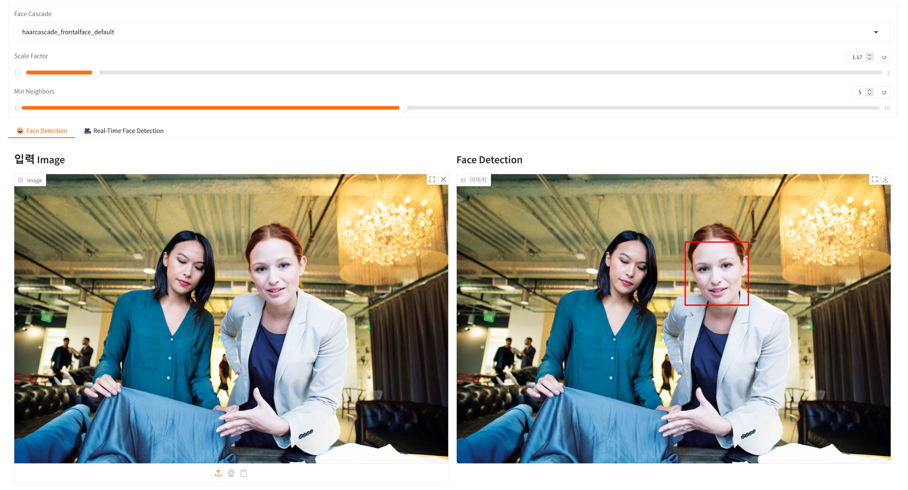
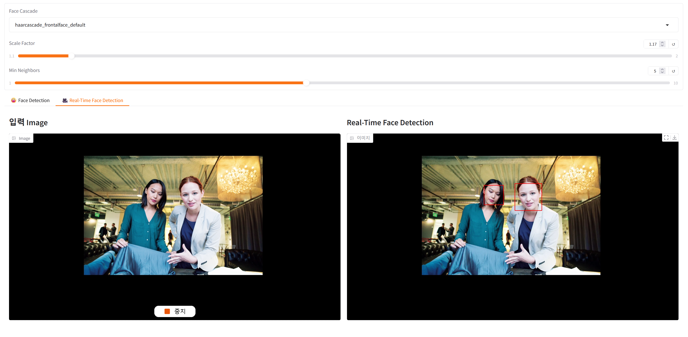
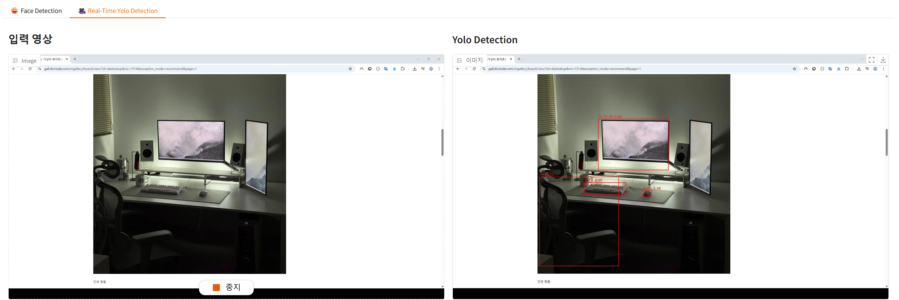
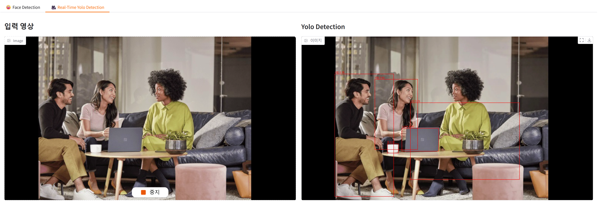

### 📂 GitHub에서 보기: [microsoft-ai-school/2025.07.07](https://github.com/J1STAR/microsoft-ai-school/tree/main/2025.07.07)

# 📅 2025년 7월 7일: OpenCV와 YOLOv3를 활용한 실시간 객체 탐지 웹 앱

## 📝 학습 목표

이번 학습에서는 순수 Python 라이브러리인 `OpenCV`와 `Gradio`를 사용하여, 로컬 환경에서 실행되는 실시간 영상 처리 웹 애플리케이션을 구축하는 것을 목표로 합니다. Azure와 같은 클라우드 서비스 없이, 직접 모델 파일을 로드하고 처리하는 과정을 통해 컴퓨터 비전의 핵심 원리를 이해합니다.

-   **로컬 모델 활용**: 사전 훈련된 `Haar Cascade` XML 파일과 `YOLOv3` 모델(`.weights`, `.cfg`)을 직접 로드하여 사용하는 방법을 학습합니다.
-   **실시간 영상 처리**: Gradio의 스트리밍 기능을 활용하여 웹캠 영상을 실시간으로 받아오고, 매 프레임마다 OpenCV를 통해 영상 처리(얼굴 탐지, 객체 탐지)를 수행하는 방법을 익힙니다.
-   **서비스 클래스 모듈화**: 얼굴 탐지(`_Face`)와 객체 탐지(`_YoloV3`) 로직을 각각의 헬퍼 클래스로 캡슐화하고, 이를 총괄하는 `OpenCVService`를 설계하여 코드의 구조성과 재사용성을 높입니다. (참고: 서비스 계층에는 향후 확장을 위해 `_YoloV8n` 클래스도 포함되어 있습니다.)
-   **대화형 UI 구축**: Gradio의 다양한 컴포넌트(탭, 드롭다운, 슬라이더)를 활용하여, 사용자가 모델의 파라미터를 실시간으로 변경하며 탐지 성능의 변화를 직관적으로 확인할 수 있는 인터페이스를 구현합니다.
-   **결과 시각화**: OpenCV와 Pillow(PIL)를 사용하여 탐지된 객체의 위치에 바운딩 박스와 텍스트 레이블을 그리고, 처리된 영상을 사용자에게 다시 스트리밍하는 방법을 실습합니다.

---

## 🖼️ 프로젝트 개요

이날의 프로젝트는 사용자가 자신의 웹캠이나 이미지 파일을 통해 **실시간 얼굴 탐지**와 **YOLOv3 객체 탐지**를 직접 체험할 수 있는 대화형 웹 애플리케이션입니다.

애플리케이션은 두 가지 주요 기능을 탭으로 구분하여 제공합니다.

1.  **얼굴 탐지 (Face Detection)**: OpenCV에 내장된 Haar Cascade 분류기를 사용하여 이미지나 영상 속에서 사람의 얼굴을 찾아냅니다. 사용자는 탐지에 사용될 분류기 모델을 직접 선택하고, `scaleFactor`와 `minNeighbors` 같은 주요 파라미터를 슬라이더로 조절하며 실시간으로 탐지 결과의 변화를 관찰할 수 있습니다.
2.  **YOLOv3 객체 탐지 (YOLOv3 Detection)**: 널리 사용되는 객체 탐지 모델인 YOLOv3를 사용하여 웹캠 영상 속의 다양한 사물(사람, 컵, 책 등)을 실시간으로 인식합니다. 탐지된 객체는 한국어 레이블과 신뢰도 점수가 포함된 바운딩 박스로 표시됩니다.

이 프로젝트를 통해 복잡한 컴퓨터 비전 기술이 어떻게 웹 인터페이스와 결합되어 사용자 친화적인 서비스로 구현될 수 있는지 직접 경험할 수 있습니다.



---

## 📁 파일 구성 및 설명

| 파일명 | 설명 |
| :--- | :--- |
| `main.py` | Gradio를 사용하여 **얼굴 탐지**와 **YOLOv3 객체 탐지** 탭을 가진 메인 애플리케이션 UI를 구성하고, 각 UI 컴포넌트의 이벤트를 `OpenCVService` 함수와 연결하는 역할을 합니다. |
| `services/opencv_service.py` | `_Face`, `_YoloV3` 헬퍼 클래스를 통해 핵심 로직을 수행하는 `OpenCVService`를 정의합니다. 또한 향후 확장을 대비한 `_YoloV8n` 클래스도 포함하고 있어, 코드의 확장성이 좋은 구조를 가집니다. |
| `models/` | `yolov3`와 `yolov8` 모델 파일들(`*.weights`, `*.cfg`, `*.names`, `*.pt`)이 저장된 디렉터리입니다. |
| `results/` | 실습 과정에서 생성된 주요 실행 결과 스크린샷 및 영상이 저장된 디렉터리입니다. |
| `README.md` | 본 학습 내용에 대한 정리 문서입니다. |

---

### 🏛️ 서비스 클래스 설계 (`services/opencv_service.py`)

이 프로젝트는 **관심사의 분리(Separation of Concerns)** 원칙에 따라 설계되었습니다. `main.py`는 사용자 인터페이스(UI) 구성에만 집중하고, 실제 컴퓨터 비전 처리 로직은 모두 `OpenCVService` 클래스에 위임합니다.

`OpenCVService`는 내부적으로 **얼굴 탐지(`_Face`)**, **YOLOv3 객체 탐지(`_YoloV3`)**, 그리고 현재 UI에는 연결되지 않았지만 확장을 위해 준비된 **YOLOv8 객체 탐지(`_YoloV8n`)** 클래스를 관리합니다.

-   **`OpenCVService`**: 메인 클래스로, `_Face`, `_YoloV3`, `_YoloV8n` 인스턴스를 생성하고 관리합니다. `@property` 데코레이터를 사용하여 외부(main.py)에서는 `opencv_service.face`나 `opencv_service.yolo_v3`와 같이 각 기능에 명확하고 직관적으로 접근할 수 있도록 합니다.
-   **`_Face`**: Haar Cascade 모델을 로드하고, `detectMultiScale` 함수를 사용하여 얼굴을 탐지하는 모든 로직을 캡슐화합니다.
-   **`_YoloV3`**, **`_YoloV8n`**: 각 YOLO 버전의 네트워크를 로드하고, 입력 이미지를 전처리하여 네트워크에 전달한 뒤, 결과에서 바운딩 박스를 추출하고 시각화하는 복잡한 과정을 버전별로 담당합니다.

이러한 구조는 코드의 가독성을 높이고, 향후 `_YoloV8n` 기능을 UI에 연결하는 등 새로운 모델을 추가하는 확장을 매우 용이하게 만듭니다.

```python
# services/opencv_service.py

class OpenCVService:
    def __init__(self) -> None:
        # 내부적으로 사용할 헬퍼 클래스들을 초기화합니다.
        self._face = _Face(face_cascade="haarcascade_frontalface_default")
        self._yolo_v3 = _YoloV3(...)
        self._yolo_v8n = _YoloV8n() # UI에는 아직 연결되지 않음

    @property
    def face(self) -> _Face:
        return self._face

    @property
    def yolo_v3(self) -> _YoloV3:
        return self._yolo_v3

    @property
    def yolo_v8n(self) -> _YoloV8n:
        return self._yolo_v8n

class _Face:
    # ... 얼굴 탐지 관련 메서드 (detect, set_cascade 등) ...

class _YoloV3:
    # ... YOLOv3 객체 탐지 관련 메서드 (detect) ...

class _YoloV8n:
    # ... YOLOv8 객체 탐지 관련 메서드 (detect) ...
```

## 🚀 주요 실행 과정 및 결과

### 1. Gradio를 이용한 대화형 UI 구성 (`main.py`)

`main.py`에서는 Gradio의 `Blocks` API를 사용하여 사용자 인터페이스를 구축합니다. `stream()`과 `change()` 이벤트 핸들러는 이 애플리케이션의 핵심적인 상호작용을 구현합니다.

-   **`stream(fn, inputs, outputs)`**: 웹캠(`Image(sources="webcam", streaming=True)`) 컴포넌트와 함께 사용됩니다. 웹캠에서 새로운 프레임이 들어올 때마다 `fn`으로 지정된 함수(예: `opencv_service.face.detect` 또는 `opencv_service.yolo_v3.detect`)가 자동으로 호출되고, 그 결과가 `outputs` 컴포넌트에 실시간으로 표시됩니다.
-   **`change(fn, inputs, outputs)`**: 드롭다운이나 슬라이더 같은 입력 컴포넌트의 값이 사용자에 의해 변경될 때마다 `fn`으로 지정된 함수(예: `opencv_service.face.set_cascade`)를 호출합니다. 이를 통해 사용자는 모델 파라미터를 동적으로 변경하고 즉시 결과에 반영되는 것을 확인할 수 있습니다.

```python
# main.py

# ... (Gradio UI 컴포넌트 생성) ...

# YOLO 탭의 웹캠 스트림이 들어올 때마다 실시간으로 YOLOv3 탐지를 수행합니다.
input_yolo_webcam.stream(
    fn=opencv_service.yolo_v3.detect,  # YOLOv3 탐지 함수를 직접 연결
    inputs=input_yolo_webcam,
    outputs=output_yolo_webcam,
)

# 얼굴 탐지 탭의 캐스케이드 드롭다운 메뉴 값이 변경되면 서비스의 캐스케이드 모델을 변경합니다.
cascade_dropdown.change(
    fn=opencv_service.face.set_cascade,
    inputs=cascade_dropdown,
)
# ...
```

#### ✨ 실행 결과 1: 이미지 기반 얼굴 탐지

사용자가 이미지를 업로드하면, `input_image.change()` 이벤트가 발생하여 `opencv_service.face.detect` 함수를 호출하고, 탐지된 얼굴에 빨간색 사각형이 그려진 결과 이미지를 오른쪽에 표시합니다.



#### ✨ 실행 결과 2: 실시간 웹캠 얼굴 탐지

웹캠 스트리밍을 통해 실시간으로 얼굴을 탐지하는 영상입니다. `scaleFactor`와 `minNeighbors` 슬라이더를 조절함에 따라 탐지 민감도가 변하는 것을 확인할 수 있습니다.


### 2. YOLOv3 객체 탐지 로직 (`services/opencv_service.py`)

`_YoloV3.detect` 메서드는 객체 탐지의 복잡한 파이프라인을 수행합니다.

1.  **이미지 전처리**: 입력 이미지를 `cv2.dnn.blobFromImage`를 사용해 YOLO 네트워크의 입력 형식에 맞는 `blob` 객체로 변환합니다. 이 과정에는 이미지 크기 조정, 정규화, 채널 순서 변경(RGB → BGR) 등이 포함됩니다.
2.  **순방향 전파 (Forward Pass)**: 생성된 `blob`을 네트워크 입력으로 설정하고 `self.net.forward()`를 호출하여 이미지에 대한 예측을 수행합니다.
3.  **결과 필터링**: 수많은 예측 결과(바운딩 박스) 중에서 신뢰도(confidence)가 0.5 이상인 유효한 결과만 선별합니다.
4.  **비최대 억제 (NMS)**: 하나의 객체에 대해 여러 개의 바운딩 박스가 겹쳐서 탐지되는 문제를 해결하기 위해, `cv2.dnn.NMSBoxes`를 사용하여 가장 적합한 박스만 남깁니다.
5.  **시각화**: 최종적으로 선택된 바운딩 박스와 클래스 레이블을 원본 이미지에 그려넣어 반환합니다.

```python
# services/opencv_service.py
class _YoloV3:
    def detect(self, image: np.ndarray) -> np.ndarray:
        # 1. 이미지를 blob으로 변환
        blob = cv2.dnn.blobFromImage(
            image, 1 / 255.0, (416, 416), swapRB=True, crop=False
        )
        self.net.setInput(blob)

        # 2. 네트워크 순방향 전파
        output_layers = self.net.getUnconnectedOutLayersNames()
        detections = self.net.forward(output_layers)

        # ... (3. 결과 필터링 및 4. NMS 로직)

        # 5. 최종 결과를 이미지에 그림
        if len(indices) > 0:
            for i in indices.flatten():
                # ...
                draw.rectangle((x, y, x + w, y + h), ...)
                draw.text((x, y - 20), label, ...)

        return np.array(pil_image)
```

#### ✨ 실행 결과 3: 실시간 YOLOv3 객체 탐지

웹캠 영상에서 실시간으로 주변의 사물들(사람, 컵, 노트북 등)을 탐지하고, 한국어 레이블과 함께 바운딩 박스를 표시하는 결과입니다.




---

## 💡 학습 정리

이번 세션을 통해 클라우드 기반의 AI 서비스 API를 사용하는 것과, 로컬 환경에서 직접 모델 파일을 다루며 컴퓨터 비전 파이프라인을 구축하는 것의 차이점을 명확히 이해할 수 있었습니다.

-   **API 활용 vs. 직접 구현**: API를 사용하면 복잡한 모델 로딩이나 전처리 과정을 추상화할 수 있어 편리하지만, 직접 모델을 다루면 `blob` 변환, `NMS` 적용 등 내부 동작 원리를 더 깊이 이해하고 세밀하게 제어할 수 있다는 장단점을 파악했습니다.
-   **Gradio의 강력함**: `Gradio`가 단순한 데모 제작 도구를 넘어, 실시간 영상 스트리밍과 동적인 파라미터 조정을 통해 매우 인터랙티브하고 교육적인 애플리케이션을 신속하게 구축할 수 있는 강력한 프레임워크임을 다시 한 번 확인했습니다.
-   **코드 구조의 중요성**: 기능이 복잡해질수록, `OpenCVService`처럼 역할을 명확히 나누어 클래스로 캡슐화하는 설계가 코드의 유지보수성과 확장성을 얼마나 향상시키는지를 체감할 수 있었습니다. 서비스 계층에 `_YoloV8n` 클래스를 미리 준비해 둠으로써, 향후 UI 변경만으로 새로운 모델을 쉽게 통합할 수 있는 기반을 마련했습니다.

궁극적으로 이번 실습은 AI 모델을 단순히 '사용'하는 것을 넘어, 모델을 애플리케이션의 일부로 '통합'하고 사용자 경험을 고려하여 서비스로 만들어내는 과정을 종합적으로 경험하는 중요한 기회였습니다.

---

## 👨‍💻 About Me

**HanByeol Jang (장한별)**

<a href="https://github.com/J1STAR"></a>
<a href="https://www.linkedin.com/in/hanbyeol-jang-44174a199/"></a>

## Contact
<a href="mailto:j.1star.0726@gmail.com" style="display:flex; align-items:center; gap:8px">j.1star.0726@gmail.com</a> 