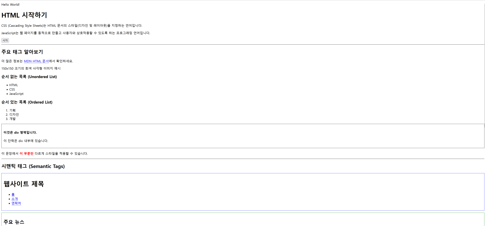
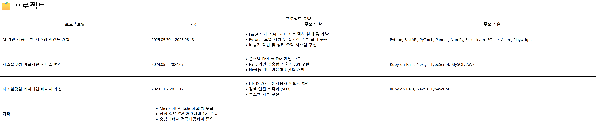

### 📂 GitHub에서 보기: [microsoft-ai-school/2025.07.09](https://github.com/J1STAR/microsoft-ai-school/tree/main/2025.07.09)

# 📅 2025년 7월 9일: 웹 프론트엔드 기초 - HTML 구조화 및 이력서 페이지 제작

## 📝 학습 목표

이번 학습에서는 웹 개발의 가장 기본이 되는 HTML(HyperText Markup Language)의 핵심 개념을 이해하고, 이를 실제로 활용하여 구조적인 웹 문서를 작성하는 것을 목표로 합니다. 또한, 학습한 내용을 바탕으로 시맨틱 태그와 CSS를 활용하여 개인 이력서 페이지를 직접 제작해 봅니다.

-   **HTML 기본 구조 이해**: `<!DOCTYPE>`, `<html>`, `<head>`, `<body>` 등 모든 HTML 문서의 기본 골격을 이해합니다.
-   **핵심 콘텐츠 태그 학습**: 텍스트, 이미지, 링크, 목록, 표 등 웹 페이지의 내용을 구성하는 주요 태그(`<h1>`-`<h6>`, `<p>`, `<a>`, ``, `<ul>`, `<ol>`, `<li>`, `<table>` 등)의 사용법을 익힙니다.
-   **시맨틱 마크업의 중요성 이해**: `<div>`와 `<span>`의 차이점을 알고, `<header>`, `<footer>`, `<nav>`, `<main>`, `<section>`, `<article>`과 같은 시맨틱 태그를 사용하여 문서의 의미 구조를 명확히 하는 방법을 학습합니다.
-   **표(Table) 고급 기능 활용**: `<thead>`, `<tbody>`, `<tfoot>`으로 표의 구조를 잡고, `colspan`과 `rowspan`으로 셀을 병합하며, `<colgroup>`으로 열 스타일을 지정하는 등 복잡한 데이터 테이블을 만드는 방법을 익힙니다.
-   **실용적 문서 작성**: 학습한 HTML 태그와 약간의 인라인 CSS를 활용하여, 실제 콘텐츠(개인 이력서)를 담은 마크다운(`ABOUT_ME.md`) 및 HTML(`about_me.html`) 문서를 직접 작성하고 스타일링합니다.

---

## 🖼️ 프로젝트 개요

이날의 학습은 두 가지 주요 결과물로 요약됩니다.

1.  **`html_basic.html`**: 웹 개발을 처음 시작하는 사람들을 위한 **HTML 기초 학습 자료**입니다. 각 태그의 역할과 사용법에 대한 상세한 설명이 한국어 주석으로 달려 있으며, MDN(Mozilla Developer Network) 공식 문서로 연결되는 링크가 포함되어 있어 심화 학습을 돕습니다.
2.  **`ABOUT_ME.md` & `about_me.html`**: 텍스트로만 제공되었던 개인 이력서 내용을, 가독성 좋게 구조화된 **마크다운 파일**과 시맨틱 HTML 태그 및 기본 스타일이 적용된 **웹 페이지**로 변환한 결과물입니다. 이를 통해 정보를 효과적으로 전달하는 방법을 실습합니다. **➡️ [결과물 확인하기](./about_me.html)**

이 프로젝트들은 HTML이 어떻게 웹 페이지의 '뼈대'를 만들고, 콘텐츠에 의미를 부여하는지를 명확하게 보여주는 실용적인 예제입니다.

---

## 📁 파일 구성 및 설명

| 파일명 | 설명 |
| :--- | :--- |
| [`html_basic.html`](./html_basic.html) | HTML의 기본부터 시맨틱 태그, 표, 멀티미디어, 폼 등 다양한 태그의 사용법을 상세한 주석과 함께 정리한 종합 학습 파일입니다. |
| [`about_me.html`](./about_me.html) | 마크다운 이력서 내용을 바탕으로, 시맨틱 HTML 태그와 CSS 스타일을 적용하여 웹 페이지로 구현한 파일입니다. |
| `ABOUT_ME.md` | 개인 이력서 내용을 마크다운 문법을 사용하여 깔끔하게 정리한 문서입니다. |
| [`table_basic.html`](./table_basic.html) | `about_me.html`의 프로젝트 정보를 추출하여 `<table>` 태그로 요약하는 방법을 실습한 파일입니다. |
| `results/` | `html_basic.html`과 `table_basic.html`의 실행 결과를 캡처한 스크린샷 이미지가 저장된 디렉터리입니다. |
| `README.md` | 본 학습 내용에 대한 정리 문서입니다. |

---

## 🚀 주요 학습 내용 및 결과

### 1. HTML 태그 종합 학습 (`html_basic.html`)

`html_basic.html` 파일은 하나의 문서 안에서 웹 페이지를 구성하는 거의 모든 핵심 태그를 다룹니다.

-   **문서 구조**: `<!DOCTYPE html>`, `<html>`, `<head>`, `<body>`
-   **콘텐츠**: `<h1>~<h6>`, `<p>`, `<button>`, `<hr>`
-   **링크와 이미지**: `<a>`(외부, 내부, mailto, tel), ``(크기 지정, 반응형)
-   **목록**: `<ul>`, `<ol>`, `<li>`, `<dl>`, `<dt>`, `<dd>`
-   **그룹화**: `<div>`, `<span>`
-   **시맨틱**: `<header>`, `<nav>`, `<main>`, `<section>`, `<article>`, `<footer>`
-   **표**: `<table>`, `<caption>`, `<thead>`, `<tbody>`, `<tfoot>`, `<tr>`, `<th>`, `<td>`, `<colgroup>`, `<col>`
-   **멀티미디어**: `<audio>`, `<video>`
-   **폼**: `<form>`, `<fieldset>`, `<legend>`, `<label>`, `<input>`, `<textarea>`, `<select>`, `<button>`

특히 **고급 표(Table)** 예제에서는 `rowspan`(행 병합)과 `colspan`(열 병합) 속성을 사용하여 복잡한 구조의 데이터를 표현하고, `<colgroup>`과 `<col>` 태그로 특정 열에만 스타일을 일괄 적용하는 방법을 학습했습니다. 또한, 다양한 `input` 타입을 활용한 **폼(Form)** 예제를 통해 사용자로부터 정보를 입력받는 방법을 실습했습니다.



### 2. 이력서 페이지 제작 및 테이블 실습 (`ABOUT_ME.md`, `table_basic.html`)

주어진 텍스트(`ABOUT_ME.md`)를 바탕으로, 정보를 논리적인 섹션으로 나누어 시맨틱 태그를 활용한 이력서 페이지(`about_me.html`)를 제작했습니다.

더 나아가, 이력서의 프로젝트 정보만을 추출하여 별도의 `table_basic.html` 파일에 `<table>` 태그로 요약하는 실습을 진행했습니다.

이 과정을 통해 동일한 콘텐츠라도 어떻게 구조화하고 표현하는지에 따라 정보 전달력이 크게 달라질 수 있음을 확인했습니다.



```html
<!-- about_me.html의 일부 -->
<section id="projects" class="section">
    <h2>PROJECTS</h2>
    <article class="project">
        <div class="project-title">
            <h3>세션 기반 상품 추천 시스템 개발</h3>
            <span class="date">2025.05.30 - 2025.06.13</span>
        </div>
        <p><strong>Overview:</strong> 사용자의 세션 기록을 기반으로 다음에 관심을 가질 만한 상품을 예측하는 추천 시스템의 백엔드 API를 개발했습니다. 이 시스템은 사용자의 행동 데이터(예: 페이지 조회, 장바구니 추가, 구매 등)를 수집하고, 이를 기반으로 개인화된 상품 추천을 제공합니다.</p>
        <p><strong>My Role & Contributions:</strong></p>
        <ul>
            <li>FastAPI를 사용하여 추천 API 서버의 전체 아키텍처를 설계하고 개발했습니다.</li>
            <li>PyTorch 기반의 GRU4Rec 모델을 서빙하고, 사용자의 세션 기록을 기반으로 다음에 관심을 가질 만한 상품을 예측하는 로직을 구현했습니다.</li>
            <li>모델 학습 및 평가 파이프라인을 설정하고, 모델 성능을 모니터링하는 대시보드를 개발했습니다.</li>
            <li>데이터 파이프라인을 구축하여 실시간 데이터 수집 및 처리 환경을 구성했습니다.</li>
            <li>Azure 클라우드 서비스를 활용하여 모델 배포 및 확장성 있는 인프라를 구축했습니다.</li>
        </ul>
         <p class="tech-stack"><strong>Tech Stack:</strong> Python, FastAPI, PyTorch, Pandas, NumPy, Scikit-learn, SQLite, Azure, Playwright</p>
        <p><strong>GitHub:</strong></p>
        <ul class="sub-list">
            <li><a href="https://github.com/7-MSAI-7/mercari-recommender-backend" target="_blank">mercari-recommender-backend</a></li>
            <li><a href="https://github.com/7-MSAI-7/GRU4Rec-Mercari" target="_blank">GRU4Rec-Mercari</a></li>
        </ul>
    </article>
    <!-- ... 다른 프로젝트들 ... -->
</section>
```

---

## 💡 학습 정리

이번 세션은 웹의 근간을 이루는 HTML을 깊이 있게 다루는 중요한 시간이었습니다.

-   **의미론적 마크업의 가치**: 단순히 `<div>`로만 구조를 짜는 대신 `<header>`, `<main>`, `<article>` 등 의미에 맞는 태그를 사용하는 것이 왜 중요한지(코드 가독성, SEO, 웹 접근성)를 명확히 이해했습니다.
-   **구조와 표현의 분리**: `html_basic.html`에서는 학습을 위해 인라인 스타일(`style="..."`)을 일부 사용했지만, `about_me.html`의 `<style>` 태그 예시를 통해 장기적으로는 HTML(구조)과 CSS(표현)를 분리하는 것이 유지보수에 유리하다는 점을 깨달았습니다.
-   **정보를 디자인하는 능력**: 이력서 프로젝트를 통해, 동일한 정보라도 어떻게 구조화하고 시각적으로 표현하는가에 따라 전달력과 전문성이 크게 달라진다는 점을 체감했습니다. 이는 기술적인 능력뿐만 아니라 커뮤니케이션 능력의 일부임을 알게 되었습니다.

결론적으로, HTML은 단순히 웹 페이지를 '보여주는' 기술을 넘어, 정보의 '구조와 의미'를 설계하는 중요한 첫걸음이라는 것을 학습했습니다.

---

## 👨‍💻 About Me

**HanByeol Jang (장한별)**

<a href="https://github.com/J1STAR"></a>
<a href="https://www.linkedin.com/in/hanbyeol-jang-44174a199/"></a>

## Contact
<a href="mailto:j.1star.0726@gmail.com" style="display:flex; align-items:center; gap:8px">j.1star.0726@gmail.com</a> 