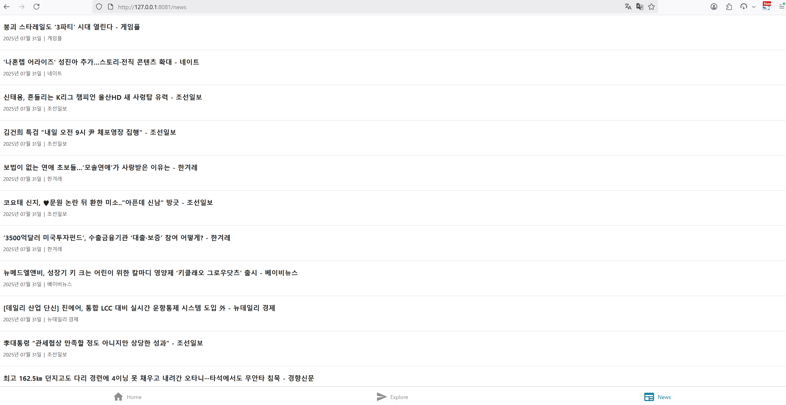

### 📂 GitHub에서 보기: [microsoft-ai-school/2025.07.31/node/news-app](https://github.com/J1STAR/microsoft-ai-school/tree/main/2025.07.31/node/news-app)

# 📅 2025년 7월 31일: React Native & Expo 기반 뉴스 애플리케이션

## 🖥️ 화면 예시



---

## 🛠️ 개발 환경 설정 및 실행

본 프로젝트는 `mise`, `Node.js`, `Yarn`을 사용한 개발 환경을 권장합니다.

### 1. 사전 준비: 개발 도구

-   **`mise`**: 다양한 프로그래밍 언어와 개발 도구의 버전을 프로젝트별로 손쉽게 관리해주는 도구입니다. 이 프로젝트에서는 `mise.toml` 파일을 통해 `node`의 버전을 명시하여, 모든 팀원이 동일한 Node.js 환경에서 개발을 진행하도록 보장합니다.
    -   **설치 가이드**: [공식 설치 문서](https://mise.jdx.dev/getting-started.html)를 참고하여 `mise`를 설치하세요.

-   **`Node.js`**: JavaScript 런타임 환경입니다. 이 프로젝트는 `24.4.1` 버전 사용을 기준으로 합니다. `mise`가 설치되어 있다면, 프로젝트 디렉토리 진입 시 자동으로 해당 버전이 활성화됩니다.
    -   **버전 확인**: `node -v`

-   **`Yarn`**: `npm`보다 빠르고 효율적인 의존성 관리를 제공하는 패키지 매니저입니다.
    -   **설치 가이드**: `npm install -g yarn` 또는 [공식 설치 문서](https://yarnpkg.com/getting-started/install)를 참고하세요.

### 2. 프로젝트 실행 단계

1.  **개발 환경 활성화**:
    프로젝트 루트 디렉토리에서 아래 명령어를 실행하면 `mise.toml`에 정의된 Node.js `24.4.1` 버전이 자동으로 활성화됩니다.
    ```bash
    mise use node@24.4.1
    ```

2.  **의존성 설치**:
    프로젝트 루트 디렉토리에서 `yarn`을 사용하여 `package.json`에 정의된 모든 패키지를 설치합니다.
    ```bash
    yarn install
    ```

3.  **Expo 서버 실행**:
    ```bash
    yarn start
    ```

4.  **앱 실행**:
    -   터미널에 QR 코드가 나타나면, Expo Go 앱(iOS) 또는 카메라(Android)로 스캔하여 디바이스에서 앱을 실행합니다.
    -   또는 터미널에서 `a`를 눌러 Android 에뮬레이터에서, `i`를 눌러 iOS 시뮬레이터에서 앱을 실행할 수 있습니다.
    -   `w`를 누르면 웹 브라우저에서 앱을 실행합니다.

> **⚠️ 주의:** 이 앱은 로컬 백엔드 서버(`http://127.0.0.1:8000`)와 통신하도록 설정되어 있습니다. 정상적인 데이터 조회를 위해서는 [Python 백엔드 프로젝트](../python)를 먼저 실행해야 합니다.

---

## 📝 프로젝트 목표

이번 프로젝트는 React Native와 Expo 프레임워크를 사용하여 Django 백엔드 서버와 통신하는 크로스 플랫폼(iOS, Android, Web) 뉴스 애플리케이션을 개발하는 것을 목표로 합니다. 최신 모바일 앱 개발 트렌드에 맞춰, 파일 기반 라우팅, 컴포넌트 기반 아키텍처, 그리고 반응형 UI 라이브러리 활용 등 핵심 개념을 실습합니다.

- **Expo 프레임워크 활용**: Expo가 제공하는 다양한 도구와 서비스를 활용하여 네이티브 코드 작성 없이 JavaScript/TypeScript만으로 빠르게 모바일 앱을 개발하고 배포하는 과정을 익힙니다.
- **파일 기반 라우팅 이해**: `expo-router`를 사용하여, 파일 시스템 구조가 그대로 앱의 네비게이션 구조가 되는 직관적인 라우팅 방식을 학습합니다. 이를 통해 화면 추가 및 관리가 용이한 확장성 있는 구조를 설계합니다.
- **API 통신 및 데이터 관리**: 백엔드 REST API(`http://127.0.0.1:8000`)를 호출하여 데이터를 가져오고, React의 상태 관리 훅(`useState`, `useEffect`)을 사용하여 비동기 데이터를 컴포넌트의 상태와 동기화하는 방법을 실습합니다.
- **컴포넌트 기반 UI 개발**: 재사용 가능한 UI 컴포넌트(`HapticTab`, `IconSymbol` 등)를 제작하고, Tamagui와 같은 UI 라이브러리를 활용하여 일관되고 반응성이 뛰어난 사용자 인터페이스를 효율적으로 구축합니다.
- **크로스 플랫폼 디자인 시스템**: 다크 모드와 라이트 모드를 모두 지원하는 동적 테마 시스템을 구축하고, `Platform` API를 사용하여 각기 다른 운영체제(iOS, Android)에 최적화된 UI를 제공하는 방법을 학습합니다.

---

## 🏛️ 시스템 아키텍처

이 애플리케이션은 전형적인 클라이언트-서버 모델에서 클라이언트 역할을 수행합니다. 데이터의 원천은 Django 백엔드 서버이며, 앱은 해당 서버의 API를 호출하여 받은 데이터를 사용자에게 보여주는 역할을 합니다.

1.  **사용자 상호작용 (User Interaction)**: 사용자가 앱의 특정 탭(예: 뉴스 탭)으로 이동합니다.
2.  **화면 렌더링 및 데이터 요청 (Screen Render & Data Fetching)**:
    -   해당 화면 컴포넌트(예: `NewsScreen`)가 렌더링됩니다.
    -   `useEffect` 훅이 트리거되어 백엔드 API 서버(`http://127.0.0.1:8000/v1/news`)로 `fetch` 요청을 보냅니다.
3.  **상태 업데이트 (State Update)**:
    -   API로부터 JSON 형식의 뉴스 데이터 배열을 수신합니다.
    -   수신한 데이터로 컴포넌트의 상태(`newsList`)를 `useState`를 통해 업데이트합니다.
4.  **UI 리렌더링 (UI Re-render)**:
    -   상태가 변경되었으므로 React가 컴포넌트를 리렌더링합니다.
    -   업데이트된 `newsList` 데이터를 화면에 목록 형태로 표시합니다.

```
+-------------------------------------------+      +------------------------------+
|           📱 React Native App             |      |       🌐 Django Backend     |
+-------------------------------------------+      +------------------------------+
|                                           |      |                              |
| [1. Navigate to News Tab]                 |      |                              |
|           |                               |      |                              |
|           v                               |      |                              |
| [2. Render Screen & useEffect]            |      |                              |
|           |                               |      |   [ API Server ]             |
|           v                               |      |                              |
| [3. fetch('/v1/news')] --------------------------->  [4. GET /v1/news]          |
|                                           |      |           |                  |
|                                           |      |           v                  |
|           +----------------------------------------- [5. Respond with JSON]     |
|           v                               |      |                              |
| [6. Receive Response & Parse]             |      |                              |
|           |                               |      |                              |
|           v                               |      |                              |
| [7. setState(newsList)]                   |      |                              |
|           |                               |      |                              |
|           v                               |      |                              |
| [8. Re-render UI with News]               |      |                              |
|                                           |      |                              |
+-------------------------------------------+      +------------------------------+
```

---

## 📁 파일 구성 및 설명

| 경로 | 파일명/디렉토리 | 설명 |
| :--- | :--- | :--- |
| `app/` | | `expo-router`의 파일 기반 라우팅을 위한 핵심 디렉토리입니다. 파일 구조가 URL 경로가 됩니다. |
| | `(tabs)/` | 탭 네비게이션으로 그룹화된 화면들을 담고 있습니다. 괄호 `()`는 URL 경로에 영향을 주지 않습니다. |
| | | `index.tsx`: 'Home' 탭에 해당하는 화면입니다. |
| | | `news.tsx`: 'News' 탭에 해당하는 화면으로, API를 호출하여 뉴스 목록을 보여줍니다. |
| | | `explore.tsx`: 'Explore' 탭에 해당하는 화면으로, 템플릿의 기능을 소개합니다. |
| | | `_layout.tsx`: `(tabs)` 디렉토리 내 화면들의 공통 레이아웃, 즉 탭 바 자체를 설정합니다. |
| | `_layout.tsx` | 앱 전체의 최상위 레이아웃입니다. 폰트, 테마 프로바이더, 스택 네비게이션을 설정합니다. |
| `components/` | | 앱 전반에서 재사용되는 커스텀 컴포넌트들을 모아둔 디렉토리입니다. |
| `constants/` | | 색상, 스타일 등 앱 전체에서 공유되는 상수 값들을 정의합니다. |
| `hooks/` | | `useColorScheme` 등 재사용 가능한 커스텀 React 훅을 정의합니다. |
| `assets/` | | 이미지, 폰트 등 정적 에셋 파일들을 관리합니다. |
| `package.json` | | 프로젝트의 메타데이터와 의존성(`dependencies`), 실행 스크립트(`scripts`)를 정의합니다. |
| `tamagui.config.ts` | | Tamagui UI 라이브러리의 테마, 토큰, 미디어 쿼리 등 전역 설정을 정의합니다. |
| `app.json` | | 앱 이름, 아이콘, 스플래시 화면 등 Expo 프로젝트의 빌드 및 배포 설정을 정의합니다. |
| `README.md` | | 본 프로젝트에 대한 설명 문서입니다. |

---

## 🚀 주요 기능 및 코드

### 1. API 데이터 연동 (`app/(tabs)/news.tsx`)

`useEffect` 훅을 사용하여 컴포넌트가 처음 렌더링될 때 백엔드 API를 호출합니다. `fetch`를 통해 비동기적으로 데이터를 가져온 후, `useState`로 상태를 업데이트하여 화면을 다시 그립니다. 이 패턴은 React에서 외부 데이터를 연동하는 가장 기본적인 방법입니다.

```tsx
export default function NewsScreen(): JSX.Element {
    const [newsList, setNewsList] = useState<NewsItem[]>([]);

    useEffect(() => {
        // 백엔드 API에 GET 요청을 보내 뉴스 데이터를 가져옵니다.
        fetch("http://127.0.0.1:8000/v1/news")
            .then((res) => res.json())
            .then((responseJson) => {
                // 가져온 데이터로 newsList 상태를 업데이트합니다.
                setNewsList(responseJson.data);
            })
            .catch((error) => {
                console.error("Failed to fetch news:", error);
            });
    }, []); // 빈 배열을 전달하여 마운트 시에만 실행되도록 합니다.

    return (
        <YStack style={{ flex: 1 }}>
            {/* newsList 배열을 순회하며 각 아이템을 렌더링합니다. */}
            {newsList.map((item) => renderItem({ item }))}
        </YStack>
    );
}
```

### 2. 파일 기반 탭 라우팅 (`app/(tabs)/_layout.tsx`)

`expo-router`의 `Tabs` 컴포넌트를 사용하여 탭 네비게이터를 선언적으로 구성합니다. 각 `Tabs.Screen` 컴포넌트의 `name` 속성은 해당 탭과 연결될 파일의 이름과 일치해야 합니다. `options`를 통해 탭의 제목이나 아이콘을 쉽게 커스터마이징할 수 있습니다.

```tsx
export default function TabLayout() {
  return (
    <Tabs screenOptions={{...}}>
      {/* 홈 탭: app/(tabs)/index.tsx와 연결 */}
      <Tabs.Screen
        name="index"
        options={{
          title: 'Home',
          ...
        }}
      />
      {/* 뉴스 탭: app/(tabs)/news.tsx와 연결 */}
      <Tabs.Screen
        name="news"
        options={{
          title: 'News',
          ...
        }}
      />
      {/* ... 다른 탭들 ... */}
    </Tabs>
  );
}
```

---

## 💡 학습 정리

이번 프로젝트를 통해 React Native와 Expo를 사용하여 현대적인 모바일 애플리케이션을 구축하는 핵심적인 과정을 경험했습니다. 컴포넌트 기반 아키텍처, 선언적인 라우팅, 비동기 데이터 처리, 그리고 일관된 디자인 시스템 적용 등, 실제 프로덕션 앱 개발에 필수적인 기술과 개념들을 종합적으로 학습할 수 있었습니다. 특히 백엔드 API와 연동하여 동적인 데이터를 화면에 표시하는 과정을 통해 풀스택 개발의 전체적인 흐름을 이해하는 계기가 되었습니다.
