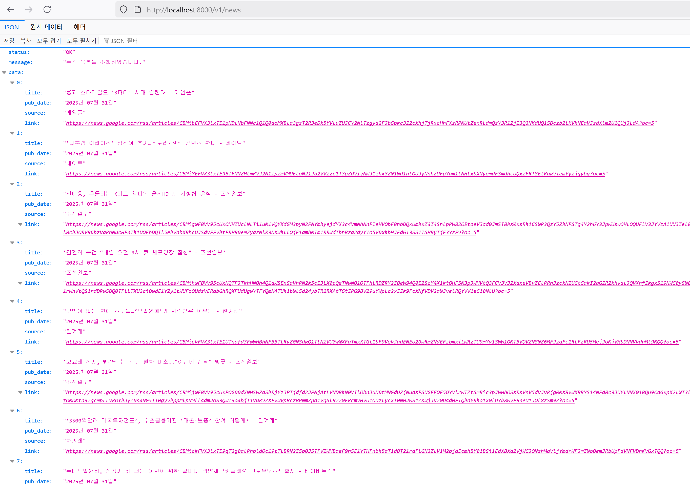

### 📂 GitHub에서 보기: [microsoft-ai-school/2025.07.31/python](https://github.com/J1STAR/microsoft-ai-school/tree/main/2025.07.31/python)

# 📅 2025년 7월 31일: Django REST Framework 기반 뉴스 API 서버 구축

## 🛠️ 개발 환경 설정 및 실행

본 프로젝트는 `mise`를 사용한 개발 환경 관리와 `uv`를 사용한 Python 패키지 관리를 권장합니다.

### 1. 사전 준비: `mise` 와 `uv`

-   **`mise`**: 다양한 프로그래밍 언어와 개발 도구의 버전을 프로젝트별로 손쉽게 관리해주는 도구입니다. `mise.toml` 파일을 통해 필요한 도구(예: Python 3.11)와 버전을 명시하면, 해당 디렉토리에 들어왔을 때 자동으로 지정된 버전으로 전환해줍니다. 이를 통해 각 개발자의 로컬 환경에 설치된 도구 버전에 관계없이 프로젝트에 명시된 특정 버전(예: Python 3.11)을 일관되게 사용하도록 보장합니다. 결과적으로 팀 전체의 개발 환경을 표준화하고, 환경 차이에서 발생하는 잠재적 오류를 방지합니다.
    -   **설치 가이드**: [공식 설치 문서](https://mise.jdx.dev/getting-started.html)를 참고하여 `mise`를 설치하세요.

-   **`uv`**: Rust로 작성된 매우 빠른 Python 패키지 관리 도구입니다. `pip`과 `venv`의 기능을 하나로 합쳐, 가상 환경 생성, 패키지 설치/삭제 등을 단일 명령어로 빠르고 일관되게 처리할 수 있습니다. `pyproject.toml`과 호환되며, `uv.lock` 파일을 통해 의존성을 고정하여 재현 가능한 빌드를 보장합니다.
    -   **설치 가이드**: [공식 설치 문서](https://github.com/astral-sh/uv#installation)를 참고하여 `uv`를 설치하세요. `mise`를 사용한다면 `mise install uv`로 간단히 설치할 수 있습니다.

### 2. 프로젝트 실행 단계

1.  **개발 환경 활성화**:
    프로젝트 루트 디렉토리에서 아래 명령어를 실행하면 `mise.toml`에 정의된 Python 버전이 자동으로 활성화됩니다.
    ```bash
    mise use python@3.11
    ```

2.  **가상 환경 생성 및 활성화**:
    `uv`를 사용하여 프로젝트를 위한 격리된 가상 환경을 생성합니다.
    ```bash
    # .venv 라는 이름의 가상환경 생성
    uv venv
    # 가상환경 활성화 (Windows)
    .venv\Scripts\activate
    # 가상환경 활성화 (macOS/Linux)
    source .venv/bin/activate
    ```

3.  **의존성 설치**:
    `pyproject.toml` 파일에 명시된 의존성을 `uv`를 통해 설치합니다.
    ```bash
    uv pip install -e .
    ```

4.  **데이터베이스 마이그레이션**:
    모델 변경 사항을 데이터베이스 스키마에 적용합니다.
    ```bash
    python manage.py makemigrations
    python manage.py migrate
    ```

5.  **개발 서버 실행**:
    ```bash
    python manage.py runserver
    ```
    서버가 실행되면 `http://127.0.0.1:8000` 주소로 API에 접근할 수 있습니다.

---

## 📝 프로젝트 목표

이번 프로젝트는 Django와 Django REST Framework(DRF)를 사용하여 견고하고 확장 가능한 뉴스 API 서버를 구축하는 것을 목표로 합니다. 외부 뉴스 소스(예: RSS 피드)에서 데이터를 수집, 저장하고, 이를 모바일 클라이언트나 다른 웹 서비스에서 사용할 수 있도록 RESTful API 형태로 제공하는 백엔드 시스템을 구현합니다.

- **Django 프로젝트 구조화**: Django의 앱(app) 개념을 활용하여 프로젝트의 관심사를 명확하게 분리합니다. 모델, 뷰, 시리얼라이저, URL 설정을 각각 모듈화하여 관리함으로써 유지보수성을 높입니다.
- **커스텀 사용자 모델 구현**: Django의 기본 사용자 모델을 확장하여, 이메일을 주 식별자로 사용하는 커스텀 `User` 모델을 설계하고 적용합니다. 이를 통해 실제 서비스에서 요구하는 유연한 회원 관리 시스템의 기반을 다집니다.
- **RESTful API 설계 및 구현**: DRF를 사용하여 뉴스 목록 조회, 사용자 인증(로그인/로그아웃), 사용자 정보 조회 등 핵심 기능을 위한 API 엔드포인트를 설계하고 구현합니다.
- **API 버전 관리**: URL 경로에 버전(예: `/v1/`)을 명시적으로 포함시켜, 향후 API가 변경되더라도 기존 클라이언트와의 호환성을 유지할 수 있는 API 버전 관리 전략을 학습합니다.
- **의존성 관리**: `uv`와 `pyproject.toml`을 사용하여 Python 프로젝트의 의존성을 선언적으로 관리하고, 일관된 개발 및 배포 환경을 보장합니다.

---

## 🏛️ 시스템 아키텍처

본 백엔드 서버는 클라이언트의 요청을 받아 처리하고 데이터베이스와 상호작용합니다.

1.  **클라이언트 (Client)**: React Native로 만들어진 모바일 앱 또는 다른 웹 서비스에서 HTTP 요청을 보냅니다.
2.  **웹 서버 (Web Server - Django)**:
    -   **URL Dispatcher**: 들어온 요청의 URL을 분석하여 적절한 API 뷰(View)로 전달합니다.
    -   **API Views**: DRF의 `APIView`를 사용하여 각 엔드포인트의 비즈니스 로직을 처리합니다. 요청 데이터를 검증하고, 서비스 로직을 호출하거나 직접 모델과 상호작용합니다.
    -   **Serializers**: Django 모델 인스턴스(쿼리셋)를 JSON과 같은 원시 데이터 타입으로 변환(직렬화)하거나, 반대로 클라이언트가 보낸 JSON 데이터를 모델 인스턴스로 변환(역직렬화)하는 역할을 합니다.
3.  **데이터베이스 (Database - SQLite)**:
    -   **Models**: `NewsItem`, `NewsChannel`, `User` 등 애플리케이션의 데이터를 구조화하여 정의합니다. Django ORM을 통해 데이터베이스 테이블과 매핑됩니다.
    -   **DB**: 실제 데이터가 영구적으로 저장되는 공간입니다. 개발 환경에서는 간편한 `SQLite`를 사용합니다.

```
+------------------+      HTTP Request       +--------------------------+
|                  | ----------------------> |                          |
|   📱 클라이언트   |                         |     🌐 Django 웹 서버     |
|                  | <---------------------- |                          |
+------------------+      HTTP Response      +--------------------------+
                                                   |
                                                   | 1. URL 분석
                                                   v
                            +---------------------------------------------+
                            |              Django Application             |
                            | +------------------+   +------------------+ |
                            | | URL Dispatcher   |-->|    API Views     | |
                            | +------------------+   +------------------+ |
                            |         ^                      | ^          |
                            |         |                      v |          |
                            | +------------------+   +------------------+ |
                            | |   Serializers    |<->|      Models      | |
                            | +------------------+   +------------------+ |
                            |                                |            |
                            +--------------------------------|------------+
                                                             |
                                                             v 5. DB 쿼리
                                                     +------------------+
                                                     |  🗄️ 데이터베이스   |
                                                     +------------------+
```

---

## 📁 파일 구성 및 설명

| 경로 | 파일명/디렉토리 | 설명 |
| :--- | :--- | :--- |
| `project/` | | Django 프로젝트의 전반적인 설정을 담고 있는 패키지입니다. |
| | [`settings.py`](https://github.com/J1STAR/microsoft-ai-school/blob/main/2025.07.31/python/project/settings.py) | 데이터베이스, 설치된 앱, 미들웨어 등 프로젝트의 모든 설정을 정의합니다. |
| | [`urls.py`](https://github.com/J1STAR/microsoft-ai-school/blob/main/2025.07.31/python/project/urls.py) | 프로젝트의 최상위 URL 라우팅을 담당합니다. `api/` 접두사로 들어오는 모든 요청을 `news` 앱의 `urls.py`로 위임(`include`)합니다. |
| `news/` | | 뉴스와 사용자 관련 기능을 모두 포함하는 핵심 Django 앱입니다. 기능별로 패키지를 분리하여 구조화했습니다. |
| | `models/` | 데이터베이스 모델을 기능별(`common.py`, `news.py`, `user.py`, `post.py`, `memo.py`)로 분리하여 정의한 패키지입니다. `__init__.py`를 통해 모델들을 상위 `models` 네임스페이스로 노출시켜 쉽게 임포트할 수 있도록 구성했습니다. |
| | `apis/` | API 뷰 로직을 버전별(`v1/`), 기능별(`news.py`, `user.py`, `post.py`)로 분리하여 정의한 패키지입니다. |
| | `serializers/` | DRF 시리얼라이저를 기능별(`news.py`, `user.py`, `post.py`)로 정의하는 패키지입니다. |
| | `crawlers/` | 외부 데이터를 수집하는 크롤러 스크립트가 위치하는 패키지입니다. (`news.py`: RSS 피드 크롤러) |
| | `requests/` | API 테스트를 위한 `.http` 파일들을 모아두는 디렉토리입니다. (예: `api_v1_users.http`) |
| | `urls/` | API URL 설정을 계층적으로 관리하는 패키지입니다. |
| | | `__init__.py`: `api/` 경로 하위의 버전별 라우팅을 담당합니다. (`v1/` -> `news.urls.v1`) |
| | | `v1/__init__.py`: `v1` API 내에서 기능별 라우팅을 담당합니다. (`users/`, `news/`, `posts/`) |
| [`manage.py`](https://github.com/J1STAR/microsoft-ai-school/blob/main/2025.07.31/python/manage.py) | | `runserver`, `makemigrations` 등 Django 관리 명령을 실행하기 위한 유틸리티 스크립트입니다. |
| [`pyproject.toml`](https://github.com/J1STAR/microsoft-ai-school/blob/main/2025.07.31/python/pyproject.toml)| | `uv`를 위한 의존성 및 프로젝트 메타데이터 설정 파일입니다. |
| `uv.lock` | | 설치된 패키지의 정확한 버전을 기록하여 환경의 일관성을 보장하는 lock 파일입니다. |
| `README.md` | | 본 프로젝트에 대한 설명 문서입니다. |

---

## 📢 API 응답 예시

`GET /v1/news/` 요청 시 다음과 같은 형식의 JSON 응답을 반환합니다.



---

## 🚀 주요 기능 및 코드

### 📅 2025년 7월 31일: 초기 API 및 커스텀 사용자 모델 구현

#### 1. 커스텀 사용자 모델

[**`news/models/user.py`**](https://github.com/J1STAR/microsoft-ai-school/blob/main/2025.07.31/python/news/models/user.py)

Django의 기본 `User` 모델 대신 이메일을 `USERNAME_FIELD`로 사용하는 커스텀 `User` 모델을 정의하여, 현대 웹 서비스의 일반적인 인증 방식을 따릅니다. `BaseUserManager`를 상속받은 `UserManager`를 구현하여 `create_user`, `create_superuser` 명령을 처리합니다.

```python
class User(BaseModel, AbstractBaseUser, PermissionsMixin):
    """
    애플리케이션의 커스텀 사용자 모델입니다.
    이메일 주소를 사용자 이름(`USERNAME_FIELD`)으로 사용합니다.
    """
    USERNAME_FIELD = 'username'
    REQUIRED_FIELDS: list[str] = ['name']

    username = models.EmailField(
        max_length=50, unique=True, verbose_name="이메일",
        help_text="로그인 시 사용될 사용자의 이메일 주소입니다."
    )
    name = models.CharField(
        max_length=30, null=True, blank=True, verbose_name="이름",
        help_text="사용자의 실명 또는 별명입니다."
    )
    # ...
    objects = UserManager()
```

#### 2. 뉴스 목록 API 뷰

[**`news/apis/v1/news.py`**](https://github.com/J1STAR/microsoft-ai-school/blob/main/2025.07.31/python/news/apis/v1/news.py)

`APIView`를 상속받아 뉴스 기사 목록을 조회하는 `GET` 요청을 처리합니다. `NewsItem` 모델에서 모든 객체를 가져와 `NewsItemSerializer`로 직렬화한 후, 표준화된 JSON 형식으로 응답합니다.

```python
class NewsItemListAPIView(APIView):
    """
    뉴스 기사 목록을 조회하기 위한 API 뷰입니다.
    """
    def get(self, request: HttpRequest, *args: Any, **kwargs: Any) -> JsonResponse:
        """
        GET 요청을 처리하여 모든 뉴스 기사 목록을 반환합니다.
        """
        news_items = NewsItem.objects.all().order_by("-pub_date")
        serializer = NewsItemSerializer(news_items, many=True)

        response_data: Dict[str, Any] = {
            "status": "OK",
            "message": "뉴스 목록을 조회하였습니다.",
            "data": serializer.data
        }
        return JsonResponse(response_data)
```

---

### 📅 2025년 7월 31일: 외부 뉴스 데이터 수집 기능 추가

#### 1. RSS 피드 크롤러

[**`news/crawlers/news.py`**](https://github.com/J1STAR/microsoft-ai-school/blob/main/2025.07.31/python/news/crawlers/news.py)

외부 뉴스 데이터를 수집하기 위해 `feedparser` 라이브러리를 사용한 RSS 피드 크롤러를 구현했습니다. 이 스크립트는 독립적으로 실행되어 주기적으로 외부 뉴스 데이터를 가져와 데이터베이스에 저장하는 역할을 합니다.

-   **데이터 파싱 및 저장**: 지정된 RSS URL(예: 구글 뉴스)로부터 피드를 가져와 파싱합니다. 파싱된 데이터는 `NewsChannel`(뉴스 제공 채널)과 `NewsItem`(개별 뉴스 기사) 모델에 맞게 정제된 후, `update_or_create` 메소드를 통해 데이터베이스에 저장됩니다. 이를 통해 중복 데이터 없이 항상 최신 상태를 유지할 수 있습니다.
-   **독립 실행 환경**: Django의 모델을 사용하지만, 웹 서버와는 별개로 실행될 수 있도록 `django.setup()`을 통해 환경을 구성합니다. `crontab`과 같은 스케줄러와 연동하여 특정 시간마다 자동으로 뉴스를 수집하는 배치(batch) 작업에 활용할 수 있습니다.

```python
def prase_and_save_rss_feed(rss_url: str):
    feed = feedparser.parse(rss_url)
    
    # ... 피드 및 채널 정보 파싱 ...
    channel, created = NewsChannel.objects.update_or_create(
        link=channel_data['link'],
        defaults=channel_data
    )

    for entry in feed.entries:
        # ... 뉴스 아이템 정보 파싱 ...
        news_item, created_item = NewsItem.objects.update_or_create(
            guid=item_data['guid'],
            defaults=item_data
        )

if __name__ == "__main__":
    google_news_rss_url = "https://news.google.com/rss/?hl=ko&gl=KR&ceid=KR:ko"
    prase_and_save_rss_feed(google_news_rss_url)
```

---

### 📅 2025년 8월 4일: API 엔드포인트 구조 변경

#### 1. API 엔드포인트 접두사 추가 및 계층적 URL 구조로 리팩토링

API의 확장성과 유지보수성을 높이기 위해 URL 구조를 개선했습니다. 모든 API 경로에 `/api` 접두사를 추가하고, URL 설정을 계층적으로 분리했습니다.

-   [**`project/urls.py`**](https://github.com/J1STAR/microsoft-ai-school/blob/main/2025.07.31/python/project/urls.py): 최상위 라우터로서, `api/` 경로로 들어오는 모든 요청을 `news.urls` 모듈로 위임합니다.
-   [**`news/urls/__init__.py`**](https://github.com/J1STAR/microsoft-ai-school/blob/main/2025.07.31/python/news/urls/__init__.py): API 버전별 라우팅을 담당합니다. `v1/` 요청을 하위 URL 설정으로 분기합니다.
-   [**`news/urls/v1/__init__.py`**](https://github.com/J1STAR/microsoft-ai-school/blob/main/2025.07.31/python/news/urls/v1/__init__.py): `v1` API 내에서 기능별(`users/`, `news/`, `posts/`) 라우팅을 담당합니다.

[**`project/urls.py` (변경 후)**](https://github.com/J1STAR/microsoft-ai-school/blob/main/2025.07.31/python/project/urls.py)
```python
urlpatterns = [
    path('admin/', admin.site.urls),
    path('api/', include('news.urls')), # 'api/' 관련 모든 요청을 news.urls로 위임
]
```

[**`news/urls/__init__.py` (신규)**](https://github.com/J1STAR/microsoft-ai-school/blob/main/2025.07.31/python/news/urls/__init__.py)
```python
urlpatterns = [
    path("v1/", include("news.urls.v1")), # 'v1/' 요청은 v1 API URL 설정으로 위임
]
```

[**`news/urls/v1/__init__.py` (신규)**](https://github.com/J1STAR/microsoft-ai-school/blob/main/2025.07.31/python/news/urls/v1/__init__.py)
```python
urlpatterns = [
    path("users/", include("news.urls.v1.user")),
    path("news/", include("news.urls.v1.news")),
    path("posts/", include("news.urls.v1.post")),
]
```

---

### 📅 2025년 8월 4일 ~ 8월 5일: 사용자 인증 및 회원가입 기능 구현

#### 1. 회원가입 API 구현 (`POST /api/v1/users/sign-up`)

클라이언트 앱에서 사용자가 신규 계정을 생성할 수 있도록 `POST /api/v1/users/sign-up` 엔드포인트를 추가했습니다. 이 API는 `news/apis/v1/user.py`의 `UserSignUpView`를 통해 처리됩니다.

-   **데이터 유효성 검사**:
    -   요청 본문에서 `email`, `password`, `name` 필드가 누락되지 않았는지 1차적으로 확인합니다.
    -   `email-validator` 라이브러리를 사용하여 제출된 이메일 주소의 형식이 유효한지 검증합니다.
    -   보안 강화를 위해 비밀번호가 최소 8자 이상인지 길이를 확인하는 로직을 포함했습니다.

-   **안전한 사용자 생성**:
    -   유효성 검사를 모두 통과하면, Django의 내장 `UserManager`가 제공하는 `create_user()` 메소드를 호출하여 `User` 객체를 생성합니다. 이 메소드는 전달받은 `password`를 평문으로 저장하지 않고, PBKDF2 알고리즘을 사용하여 안전하게 해싱(hashing)한 후 데이터베이스에 저장합니다.

-   **자동 로그인 처리**:
    -   사용자 객체가 성공적으로 데이터베이스에 저장된 후, `django.contrib.auth.login` 함수를 호출합니다. 이 함수는 현재 요청(request)에 세션 데이터를 생성하고, 클라이언트에게 세션 ID가 포함된 쿠키를 발급하여 즉시 로그인 상태로 만듭니다. 이를 통해 사용자는 회원가입 후 별도의 로그인 절차 없이 서비스를 바로 이용할 수 있습니다.

[**`news/apis/v1/user.py`**](https://github.com/J1STAR/microsoft-ai-school/blob/main/2025.07.31/python/news/apis/v1/user.py)
```python
class UserSignUpView(APIView):
    def post(self, request: HttpRequest) -> JsonResponse:
        # ... 데이터 유효성 검사 ...
        user = User.objects.create_user(email=email, password=password, name=name)
        login(request, user)
        return JsonResponse({"status": "OK", "message": "회원가입 성공"})
```

#### 2. 세션을 이용한 사용자 인증 (`GET /api/v1/users/me`)

클라이언트가 앱 실행 시 로그인 상태를 확인하고 사용자 정보를 가져갈 수 있도록 `GET /api/v1/users/me` 엔드포인트를 구현했습니다. `request.user.is_authenticated` 속성을 통해 인증 여부를 확인하고, 인증된 사용자의 정보를 반환합니다.

-   이 API는 별도의 요청 데이터 없이, 요청에 포함된 세션 쿠키를 통해 사용자를 식별합니다.
-   `request.user.is_authenticated`를 확인하여 사용자가 인증된 상태이면, 해당 사용자의 정보를 `UserSerializer`를 통해 직렬화하여 반환합니다.
-   인증되지 않은 사용자일 경우, 401 Unauthorized 에러를 반환합니다.
-   이 엔드포인트는 클라이언트 앱이 시작될 때 호출되어, 사용자의 로그인 상태를 복원하고 UI를 적절하게 설정하는 데 사용됩니다.

---

### 📅 2025년 8월 5일: 게시글(Post) 기능 구현

사용자 참여를 위한 기본적인 게시판 기능을 구현했습니다.

#### 1. 데이터 모델링

[**`news/models/post.py`**](https://github.com/J1STAR/microsoft-ai-school/blob/main/2025.07.31/python/news/models/post.py)

-   `Post` 모델은 `title`, `content` 필드와 함께 작성자(`author`)를 `User` 모델에 대한 외래 키(ForeignKey)로 지정하여 데이터 무결성을 보장합니다.
-   데이터를 실제로 삭제하지 않고 삭제 시간만 기록하는 '소프트 삭제(Soft Delete)' 방식을 위해 `removed_at` 필드를 추가했습니다.
-   `Post` 모델은 `title`(CharField), `content`(TextField), `author`(ForeignKey to User), `removed_at`(DateTimeField) 필드로 구성됩니다.
-   `author` 필드는 `User` 모델과 다대일 관계(ForeignKey)를 맺어, 각 게시글의 작성자를 명확하게 지정하고 데이터베이스 수준에서 참조 무결성을 보장합니다.
-   `removed_at` 필드는 실제 데이터를 삭제하는 대신 삭제 시간을 기록하는 '소프트 삭제(Soft Delete)' 방식을 위해 추가되었습니다. `GET` 요청 처리 시 이 필드가 `null`인 데이터만 조회합니다.

#### 2. 게시글 API 구현

[**`news/apis/v1/post.py`**](https://github.com/J1STAR/microsoft-ai-school/blob/main/2025.07.31/python/news/apis/v1/post.py)

`PostListView`는 `GET`과 `POST` 요청을 모두 처리합니다.

-   **`GET /api/v1/posts/`**:
    -   삭제되지 않은(`removed_at__isnull=True`) 게시글만 조회합니다.
    -   URL 쿼리 파라미터 `q`를 사용하여, `title` 또는 `content`에 검색어가 포함된 게시글을 필터링하는 검색 기능을 제공합니다.
-   **`POST /api/v1/posts/`**:
    -   `request.user.is_authenticated`를 확인하여 로그인된 사용자만 게시글을 작성할 수 있도록 제한합니다.
    -   `author` 필드는 현재 로그인된 사용자인 `request.user`로 자동 설정하여, 게시글이 항상 실제 작성자와 연결되도록 합니다.

-   **데이터 모델링 ([`news/models/post.py`](https://github.com/J1STAR/microsoft-ai-school/blob/main/2025.07.31/python/news/models/post.py))**:
    -   `Post` 모델은 `title`(CharField), `content`(TextField), `author`(ForeignKey to User), `removed_at`(DateTimeField) 필드로 
    구성됩니다.
    -   `author` 필드는 `User` 모델과 다대일 관계(ForeignKey)를 맺어, 각 게시글의 작성자를 명확하게 지정하고 데이터베이스 수준에서 참조 
    무결성을 보장합니다.
    -   `removed_at` 필드는 실제 데이터를 삭제하는 대신 삭제 시간을 기록하는 '소프트 삭제(Soft Delete)' 방식을 위해 추가되었습니다. `GET` 
    요청 처리 시 이 필드가 `null`인 데이터만 조회합니다.

```python
class PostListView(APIView):
    def get(self, request):
        query = request.query_params.get("q", "")
        posts = Post.objects.filter(
            Q(removed_at__isnull=True)
            & (Q(title__icontains=query) | Q(content__icontains=query))
        )
        # ... serializer ...
        return JsonResponse(...)

    def post(self, request):
        if not request.user.is_authenticated:
            return JsonResponse(...)
        # ...
        post = Post.objects.create(
            title=title, content=content, author=request.user
        )
        # ... serializer ...
        return JsonResponse(...)
```

---

### 📅 2025년 8월 6일: 게시글 기능 고도화 및 모델 리팩토링

#### 1. 게시글 상세 API(CRUD) 구현 및 권한 검증

기존 게시글 목록/생성 API(`PostListView`) 외에, 특정 게시글 하나를 조회(GET), 수정(PUT/PATCH), 삭제(DELETE)할 수 있는 상세 API `PostDetailView`를 구현했습니다.

-   **엔드포인트**: `GET, PUT, PATCH, DELETE /api/v1/posts/<uuid:pk>/`
-   **주요 기능**:
    -   **조회 (`GET`)**: `<uuid:pk>`에 해당하는 게시글의 상세 정보를 반환합니다.
    -   **수정 (`PUT`, `PATCH`)**: 게시글의 정보를 전체 또는 부분적으로 수정합니다.
    -   **삭제 (`DELETE`)**: 실제 데이터베이스에서 로우를 삭제하는 대신, `removed_at` 필드에 현재 시간을 기록하는 '소프트 삭제(Soft Delete)' 방식으로 처리하여 데이터 복구 가능성을 열어두었습니다.

-   **권한 검증 로직**:
    -   데이터의 무결성과 보안을 위해, 수정 및 삭제 요청 시 **요청을 보낸 사용자(`request.user`)가 해당 게시글의 작성자(`post.author`)와 일치하는지 확인**하는 검증 절차를 추가했습니다.
    -   만약 일치하지 않는다면, `403 Forbidden` 상태 코드와 함께 "수정 권한이 없습니다." 또는 "삭제 권한이 없습니다." 라는 명확한 에러 메시지를 반환하여 비인가 접근을 차단합니다.

[**`news/apis/v1/post.py`**](https://github.com/J1STAR/microsoft-ai-school/blob/main/2025.07.31/python/news/apis/v1/post.py)
```python
class PostDetailView(PostObjectMixin, APIView):
    def put(self, request, pk, partial=False):
        post = self.get_object(pk)
        
        # 로그인 여부 및 작성자 일치 여부 확인
        if not request.user.is_authenticated:
            return JsonResponse({"status": "error", "message": "로그인이 필요합니다."}, status=401)
        if post.author != request.user:
            return JsonResponse({"status": "error", "message": "수정 권한이 없습니다."}, status=403)

        serializer = PostSerializer(post, data=request.data, partial=partial)
        if serializer.is_valid():
            serializer.save()
            return JsonResponse({"status": "ok", "message": "게시글을 수정하였습니다.", "data": serializer.data})
        return JsonResponse({"status": "error", "message": serializer.errors}, status=400)

    def delete(self, request, pk):
        post = self.get_object(pk)

        if post.author != request.user:
            return JsonResponse({"status": "error", "message": "삭제 권한이 없습니다."}, status=403)
            
        post.removed_at = timezone.now()
        post.save()
        return JsonResponse({"status": "ok", "message": "게시글을 삭제하였습니다."}, status=204)
```

#### 2. 데이터 모델 리팩토링 및 확장

데이터 구조의 일관성과 확장성을 개선하기 위해 모델을 리팩토링했습니다.

-   **UUID 기본 키(Primary Key) 도입**:
    -   모든 모델의 기본이 되는 `BaseModel`의 `id` 필드를 기존 AutoField에서 `UUIDField`로 변경했습니다. 이는 추측하기 어려운 고유 식별자를 사용하여 API 엔드포인트의 보안을 강화하고, 분산 환경에서의 데이터 통합을 용이하게 합니다.
    -   이에 따라 `Post` 모델을 포함한 모든 하위 모델의 기본 키가 `UUID` 타입으로 변경되었습니다.

-   **공통 필드 및 매니저 추가**:
    -   `BaseModel`에 `created_at`(생성일시), `updated_at`(수정일시), `removed_at`(삭제일시) 필드를 추가하여 모든 데이터의 생성/수정/삭제 시간을 자동으로 기록하도록 개선했습니다.
    -   소프트 삭제된 데이터를 기본적으로 제외하고 조회하는 커스텀 `ModelManager`를 `BaseModel`에 적용하여, 별도의 필터링 코드 없이도 삭제된 데이터를 제외한 결과만을 안전하게 가져올 수 있도록 기본 동작을 변경했습니다.

-   **`User` 모델 필드 확장**:
    -   향후 사용자 관련 기능 확장을 고려하여, `User` 모델에 `address`(주소)와 `phone_number`(전화번호) 필드를 추가했습니다.
    -   Django 관리자(admin) 페이지에서 커스텀 `User` 모델을 원활하게 사용하기 위해, 기존 `AbstractBaseUser` 상속 구조에서 `AbstractUser`를 상속받도록 변경하고 관련 설정을 수정했습니다.

[**`news/models/common.py`**](https://github.com/J1STAR/microsoft-ai-school/blob/main/2025.07.31/python/news/models/common.py)

```python
class BaseModel(models.Model):
    # ...
    id = models.UUIDField(primary_key=True, default=uuid.uuid4, unique=True, verbose_name="ID")
    created_at = models.DateTimeField(auto_now_add=True, verbose_name="생성일시")
    updated_at = models.DateTimeField(auto_now=True, verbose_name="수정일시")
    removed_at = models.DateTimeField(null=True, blank=True, verbose_name="삭제일시")
    # ...
    class Meta:
        abstract = True
```

[**`news/models/user.py`**](https://github.com/J1STAR/microsoft-ai-school/blob/main/2025.07.31/python/news/models/user.py)

```python
class User(BaseModel, AbstractUser, PermissionsMixin):
    # ...
    address = models.CharField(max_length=255, null=True, blank=True, verbose_name="주소")
    phone_number = models.CharField(max_length=20, null=True, blank=True, verbose_name="전화번호")
    # ...
```

---

## 💡 학습 정리

이번 프로젝트를 통해 Django와 DRF를 사용하여 체계적인 백엔드 API 서버를 구축하는 전반적인 과정을 학습했습니다. 특히, 단순히 기능을 구현하는 것을 넘어, 커스텀 사용자 모델 적용, 모듈화된 프로젝트 구조 설계, API 버전 관리 등 실제 프로덕션 환경에서 요구되는 중요한 설계 원칙들을 적용하는 경험을 할 수 있었습니다. 이는 향후 더 복잡하고 규모가 큰 백엔드 시스템을 개발하는 데 있어 튼튼한 기반이 될 것입니다.

---

## 👨‍💻 About Me

**HanByeol Jang (장한별)**

<a href="https://github.com/J1STAR"></a>
<a href="https://www.linkedin.com/in/hanbyeol-jang-44174a199/"></a>

## Contact
<a href="mailto:j.1star.0726@gmail.com" style="display:flex; align-items:center; gap:8px">j.1star.0726@gmail.com</a> 
